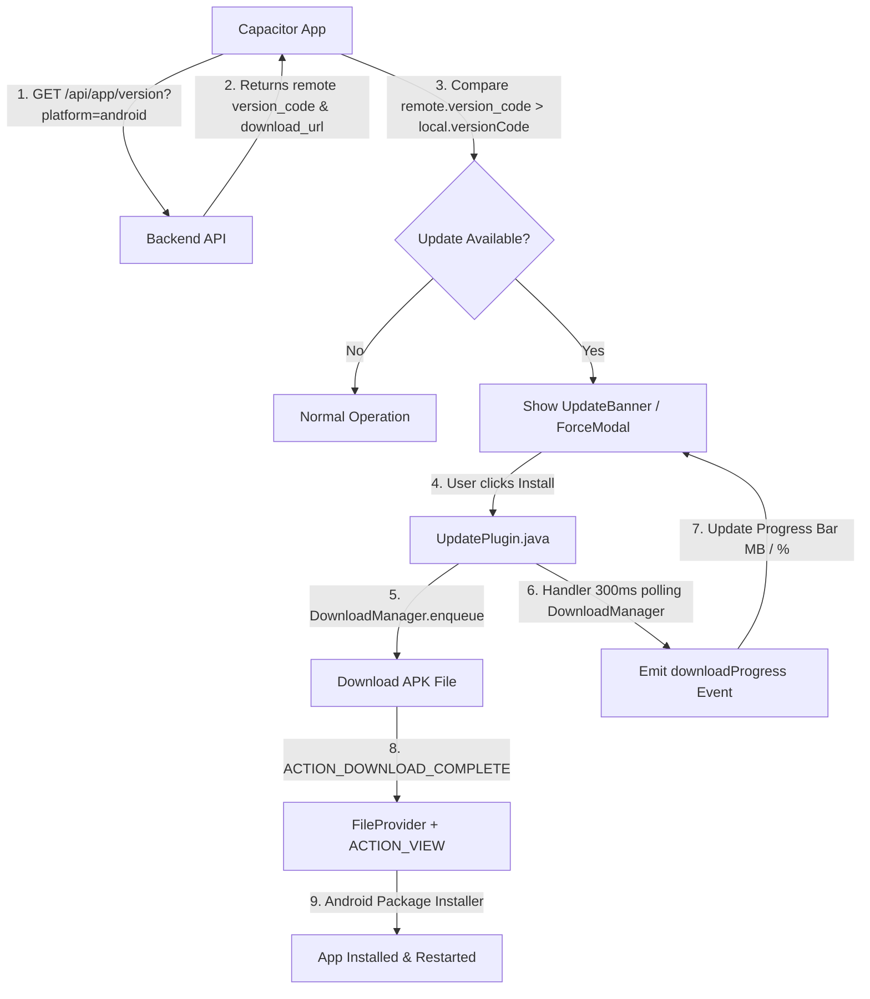

# Механизм автообновлений Android-приложения (In-App Auto Update)

Документ описывает архитектуру и работу механизма обновления мобильного Android-приложения (Capacitor) без использования Google Play Store: проверка версий, скачивание APK с прогресс-баром байтов и вызов нативного инсталлятора Android.

---

## 1. Обзор архитектуры

Обновление происходит внутри приложения при его запуске или периодически (раз в 60 секунд):



---

## 2. Бэкенд (Go)

### 2.1 Эндпоинты

- **`GET /api/app/version?platform=android`** — получение информации о последней доступной версии приложения.

### 2.2 Формат ответа сервера (`200 OK`)

```json
{
  "version_code": 102,
  "version_name": "1.0.2",
  "download_url": "/releases/healthlogin-app-v1.0.2.apk",
  "force_update": false,
  "release_notes": "Добавлен чат реального времени и отображение прогресса скачивания."
}
```

#### Поля ответа:
| Поле | Тип | Описание |
| :--- | :--- | :--- |
| `version_code` | `INT` | Инкрементальный номер сборки Android (`versionCode`). Сравнивается с локальным `info.versionCode`. |
| `version_name` | `STRING` | Человекочитаемая версия (`1.0.2`). |
| `download_url` | `STRING` | Относительный или абсолютный URL для скачивания файла APK. |
| `force_update` | `BOOL` | `true` — модальное окно на весь экран без возможности закрытия; `false` — баннер с возможностью скрыть. |
| `release_notes` | `STRING` | Список изменений новой версии. |

---

## 3. Нативный Android-слой (`UpdatePlugin.java`)

Нативный плагин зарегистрирован в Capacitor под именем `"AppUpdate"`.

### 3.1 Методы плагина

1. **`getCurrentVersion()`**  
   Извлекает `versionCode` и `versionName` установленного приложения через `PackageManager.getPackageInfo()`.

2. **`downloadAndInstall({ url: string })`**  
   - Запрашивает разрешение `REQUEST_INSTALL_PERMISSION` (установка из неизвестных источников) при необходимости.
   - Очищает старые версии APK из каталога Downloads.
   - Запускает `DownloadManager.Request`.
   - Регистрирует `BroadcastReceiver` на событие `ACTION_DOWNLOAD_COMPLETE`.
   - **Отслеживание прогресса**: Запускает нативный `Handler` с опросом статуса каждые 300 мс (`COLUMN_BYTES_DOWNLOADED_SO_FAR` и `COLUMN_TOTAL_SIZE_BYTES`).
   - Отправляет событие `notifyListeners("downloadProgress", data)` во фронтенд.

### 3.2 Установка файла APK (`FileProvider`)

После завершения скачивания:
1. Формируется защищенный `content://` URI через `FileProvider` (`com.healthlogin.app.fileprovider`).
2. Запускается Intent `ACTION_VIEW` с MIME-типом `application/vnd.android.package-archive` и флагом `FLAG_GRANT_READ_URI_PERMISSION`.
3. Система открывает стандартный диалог установки Android.

---

## 4. Фронтенд (Vue 3 + TypeScript)

### 4.1 Компоненты

| Файл | Назначение |
| :--- | :--- |
| `src/plugins/app-update.ts` | Регистрация плагина Capacitor `AppUpdate` и типизация события `downloadProgress`. |
| `src/composables/useAppUpdate.ts` | Реактивный Vue-синглтон для проверки версий, подписки на прогресс байт и управления состоянием скачивания. |
| `src/components/UpdateBanner.vue` | UI-компонент плашки обновления и принудительного модального окна с прогресс-баром. |

### 4.2 Отображение прогресс-бара скачивания

При нажатии на кнопку **«Установить обновление»**:
1. Переменная `isDownloading` становится `true`.
2. Вместо кнопки отображается компонента `<va-progress-bar :model-value="downloadProgress" />`.
3. Отображается текстовый индикатор байтов: **`"12.4 MB / 25.1 MB (49%)"`**.

```vue
<div v-if="installing || isDownloading" class="progress-section my-3">
  <va-progress-bar :model-value="downloadProgress" color="primary" class="mb-1" />
  <div class="d-flex justify-content-between text-xs text-secondary">
    <span>{{ formattedDownloaded }} / {{ formattedTotal }}</span>
    <span>{{ downloadProgress }}%</span>
  </div>
</div>
```

---

## 5. Сценарии обновления

### 5.1 Обычное обновление (`force_update: false`)
1. Пользователь видит закрываемый плавающий баннер вверху экрана с кнопкой «Установить обновление».
2. При клике запускается фоновая загрузка, плашка плавно трансформируется в прогресс-бар скачивания.
3. По завершении скачивания автоматически открывается экран инсталляции Android.

### 5.2 Принудительное обновление (`force_update: true`)
1. Экран блокируется полноэкранным модальным окном (без кнопки закрытия).
2. Нажатие кнопки переводит модальное окно в режим прогресс-бара с индикацией мегабайт.
3. До завершения установки использование приложения заблокировано.
