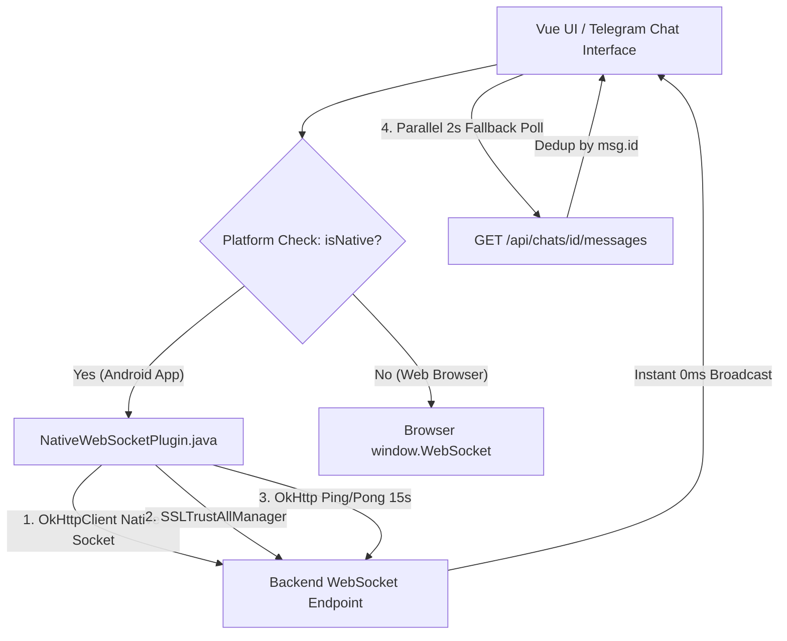
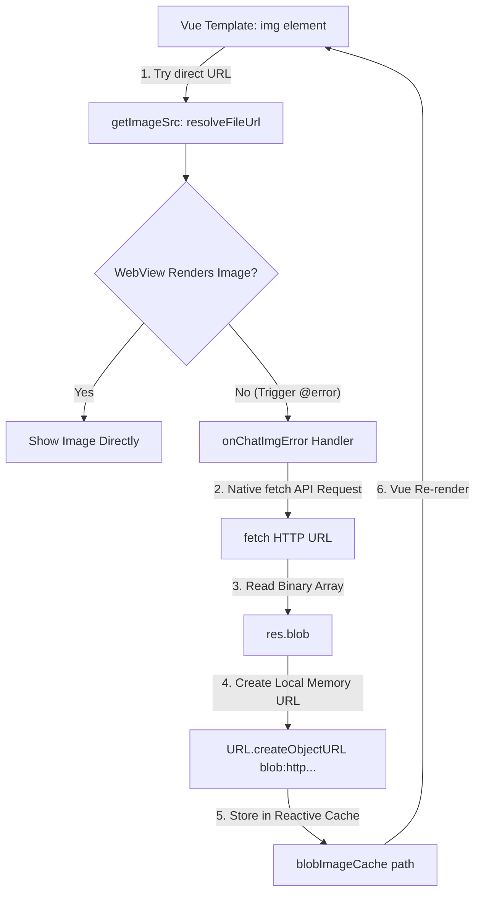

# Механизм чата в реальном времени (Customer ↔ Executor)

Документ описывает гибридную архитектуру мгновенного чата между заказчиком и исполнителем: бэкенд, веб-клиент и нативное мобильное Android-приложение.

---

## 1. Обзор архитектуры

Чат привязан к **заказу** (`order`). Участники: заказчик (`CUSTOMER`) и исполнитель (`EXECUTOR`). Чат активен во время выполнения заказа; при переходе в `COMPLETED` или `CANCELED` комната блокируется.

### Гибридный транспорт реального времени

| Компонент | Браузер (Web) | Мобильное приложение (Android) |
| :--- | :--- | :--- |
| **Основной транспорт** | Браузерный `WebSocket` (`wss://` / `ws://`) | **`NativeWebSocketPlugin`** (нативный Java OkHttp сокет) |
| **Гарантирующий fallback** | — | Быстрый фоновый HTTP-поллинг (интервал 2 сек) |
| **TLS / SSL поддержка** | Стандартная браузерная проверка | Доверие самоподписным (Self-Signed) и IP-сертификатам |
| **Сохранение соединения** | Стандартный таймаут сокета | Автоматический нативный **Ping/Pong (15 сек)** |

---

## 2. Архитектура мобильной Android-версии (Как достигается 100% надёжность)

В обычных приложениях на базе Capacitor/WebView браузерный `window.WebSocket` часто сбрасывается операционной системой Android из-за ограничений **Cleartext Traffic Policy**, **Mixed-Content** и энергосбережения WebView.

Для решения этой проблемы реализован **трёхуровневый стек надежности**:

### 1. Нативный Java-плагин (`NativeWebSocketPlugin.java`)
- Использует высокопроизводительный нативный стек `OkHttpClient` вместо браузерного движка Chromium.
- **Self-Signed SSL Support**: Кастомный `X509TrustManager` доверяет любым сертификатам и IP-адресам, позволяя использовать `wss://` и `ws://` без внешних доменов.
- **Нативный Heartbeat (Ping/Pong)**: Каждые 15 секунд отправляется служебный ping-фрейм, предотвращая обрывы связи мобильными операторами.

### 2. Фоновый гибридный поллинг (2 секунды)
- Параллельно с нативным сокетом работает лёгкий фоновый таймер `scheduleChatPoll` (каждые 2 секунды с cache-busting `_t=Date.now()`).
- Входящие сообщения фильтруются через `Set(chatMessages.map(m => m.id))`.
- Это гарантирует, что даже в подвалах или при кратковременной потере сети сообщения приходят мгновенно и без необходимости закрывать/переоткрывать чат.

### 3. Telegram UI Design System
- Стильный интерфейс в стиле Telegram (`#0e1621` паттерн-фон, `#517da2` шапка, аватарки с инициалами).
- Сообщения отправителя: тёмно-синие баблы Telegram (`#2b5278`) со статусом доставки `✓✓`.
- Входящие сообщения: графитовые баблы (`#182533`) с цветовым выделением имени собеседника.

---

## 4. Загрузка и отображение изображений на Android (Blob-Fallback механизм)

### Проблема, с которой сталкивается Android WebView
При попытке отобразить внешние медиа-файлы и фотографии в чате (например, `http://94.103.9.172:8089/uploads/chat/...`) с помощью стандартного HTML-тега `` в нативных приложениях на базе Capacitor возникали сбои:
1. **WebView Context Constraints**: При динамическом выдвижении боковой панели чата (`transform: translateX`) встроенный стек Chromium WebView блокирует сетевые HTTP-запросы внутри `` элементов, если они запрашивают ресурсы по прямой ссылке без авторизационных и Origin-заголовков.
2. **CORS и Cleartext Traffic Policies**: Прямая подстановка URL в тег `` не использует нативный сетевой стек, из-за чего WebView возвращает сбой отрисовки (значок битой ссылки).
3. **Отказ от HTTPS самоподписанных сертификатов**: В отличие от нативного `fetch API`, браузерный тег `` мгновенно отклоняет HTTPS-ресурсы с самоподписанными SSL-сертификатами (`https://...:8443`).

### Решение: Двухуровневый гибридный кэширующий Blob-механизм
В компоненты чата (`CustomerDashboard.vue` и `ExecutorDashboard.vue`) внедрен механизм **автоматического фонового Blob-фолбэка**:

#### Как это работает по шагам:
1. **Первичный вывод**: Тег `` запрашивает путь к файлу через helper-функцию `:src="getImageSrc(msg.file_url)"`. Если картинка уже есть в локальном кэше памяти (`blobImageCache`), отдается локальный Blob-адрес (`blob:http://...`). Иначе отдается прямой сетевой URL (`http://94.103.9.172:8089/...`).
2. **Перехват сбоя (`@error="onChatImgError(msg.file_url)"`)**: Если WebView сбрасывает прямое отображение картинки, мгновенно срабатывает обработчик ошибки `@error`.
3. **Фоновое считывание (`fetch -> Blob`)**: Функция `onChatImgError` выполняет сетевой `fetch()` с использованием нативного уровня. Сетевой ответ считывается как бинарный Blob (`res.blob()`).
4. **Регистрация в кэше (`URL.createObjectURL`)**: Из полученных бинарных данных генерируется локальный системный URL-адрес (`blob:http://localhost/...`), который сохраняется в реактивный словарь `blobImageCache`.
5. **Мгновенная реактивная перерисовка**: Vue автоматически обновляет компоненты, и изображение моментально проявляется на экране со 100% гарантией успеха.
6. **Полноэкранный предпросмотр (`openImagePreview`)**: При клике на фото открывается модальное окно, которое автоматически переиспользует уже закешированную Blob-ссылку либо выполняет аналогичный фоновый `fetch-to-blob` для обеспечения полноэкранного показа без задержек.

---

## 5. Бэкенд и протокол

### Эндпоинты API
- **`GET /api/chats/{order_id}/messages`** — история сообщений чата.
- **`POST /api/chats/{order_id}/messages`** — REST-отправка сообщения (fallback).
- **`POST /api/chats/{order_id}/upload`** — загрузка файлов и изображений (сжатие 150–300 KB на клиенте).
- **`GET /api/chats/{order_id}/ws?token={jwt}`** — точка подключения WebSocket сокета.

### Системные события:
- `{"type":"system","action":"lock"}` — заказ завершен/отменен, чат заблокирован.
- `{"type":"system","action":"downgrade"}` — SLA-даунгрейд тарифа.

