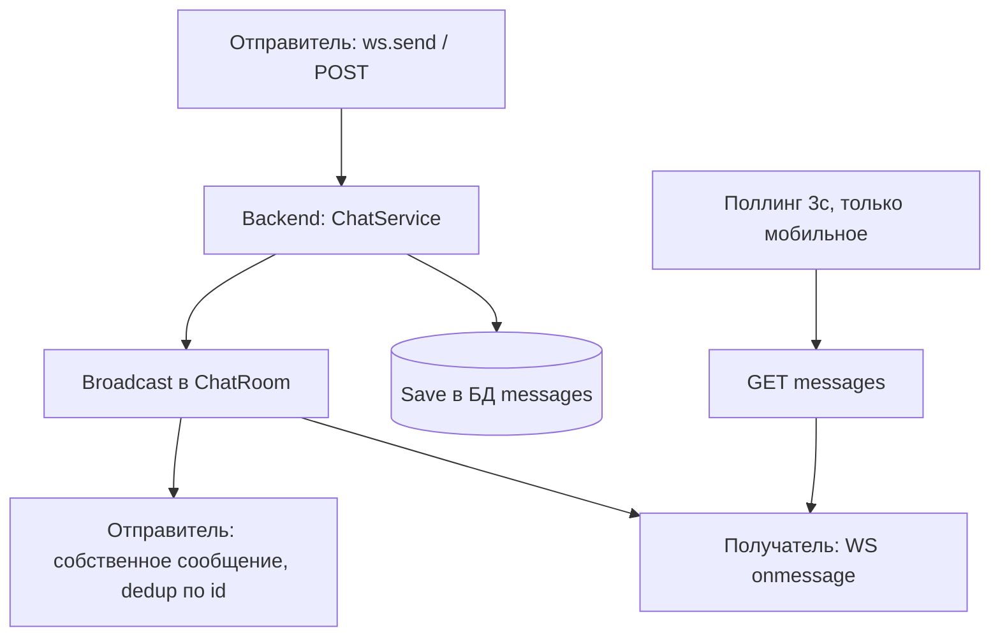

# Механизм чата (Customer ↔ Executor)

Документ описывает архитектуру чата между заказчиком и исполнителем: бэкенд, веб-клиент и мобильное Android-приложение (Capacitor).

---

## 1. Обзор

Чат привязан к **заказу** (`order`). Один заказ — одна комната чата. Участники: заказчик (`CUSTOMER`) и назначенный исполнитель (`EXECUTOR`). Чат активен, пока заказ в статусах `SEARCHING` / `ASSIGNED`; при переходе в `COMPLETED` или `CANCELED` комната блокируется (read-only).

### Два транспортных канала

| Канал | Назначение | Платформа |
| :--- | :--- | :--- |
| **WebSocket** | Приём и отправка сообщений в реальном времени | Веб (основной), мобильное приложение (основной + fallback) |
| **HTTP REST** | Загрузка истории, fallback-отправка, поллинг входящих | Веб (история), мобильное приложение (история + fallback приёма/отправки) |

### Поток данных



---

## 2. Бэкенд

### 2.1. Компоненты

| Файл | Компонент | Назначение |
| :--- | :--- | :--- |
| `backend/service/chat.go` | `ChatService` | Управление комнатами, WebSocket-цикл, сохранение сообщений |
| `backend/handler/chat.go` | `ChatHandler` | HTTP-обработчики: история, отправка, WS-upgrade |
| `backend/repository/chat.go` | `ChatRepository` | Доступ к таблицам `chats`, `messages` |
| `backend/main.go` | маршруты | Регистрация эндпоинтов под `/api` и под корнем `/*` |

### 2.2. Структуры данных

```go
type Chat struct {
    ID       uuid.UUID  // первичный ключ комнаты
    OrderID  uuid.UUID  // связь с заказом
    IsActive bool       // false → чат заблокирован (COMPLETED/CANCELED)
}

type Message struct {
    ID        uuid.UUID
    ChatID    uuid.UUID
    SenderID  uuid.UUID  // кто отправил
    Text      string
    CreatedAt time.Time
}
```

### 2.3. Эндпоинты

Все маршруты зарегистрированы **дважды**: под `/api/*` (веб + пересобранный APK) и под `/*` (legacy — уже установленные APK, ходящие напрямую на порт 8089).

| Метод | Путь | Назначение | Доступ |
| :--- | :--- | :--- | :--- |
| GET | `/api/chats/{order_id}/messages` | История сообщений | CUSTOMER, EXECUTOR |
| POST | `/api/chats/{order_id}/messages` | Отправить сообщение (REST fallback) | CUSTOMER, EXECUTOR |
| GET | `/api/chats/{order_id}/ws` | WebSocket-upgrade | CUSTOMER, EXECUTOR |

Авторизация:
- REST/HTTP — через middleware (`Authorization: Bearer` / Cookie `token` / `?token=` query).
- WebSocket — через `?token=` query-параметр (браузер не позволяет добавить заголовок к WS-handshake).

### 2.4. WebSocket-протокол

**Upgrader** (`gorilla/websocket`) с `CheckOrigin: true` — принимает любые origin (CORS обрабатывается на уровне chi-middleware).

**Жизненный цикл комнаты (`ChatRoom`):**
- `Register` / `Unregister` каналы для подключения/отключения клиентов.
- `Broadcast` канал для рассылки сообщения всем клиентам комнаты.
- Комната хранится в `map[orderID]*ChatRoom`; создаётся лениво при первом WS-подключении или REST-отправке.
- При `len(clients) == 0` комната удаляется из памяти.

**ReadPump** (приём от клиента):
1. Читает фрейм `{"text": "..."}`.
2. Проверяет статус заказа — если `COMPLETED`/`CANCELED`, деактивирует чат и шлет `{"type":"system","action":"lock"}`.
3. Проверяет `chat.IsActive` в БД — если false, шлёт `{"type":"error","message":"Chat is locked"}`.
4. Сохраняет сообщение через `chatRepo.SaveMessage`.
5. Рассылает сохранённое сообщение всем клиентам через `Broadcast`.

**WritePump** (отправка клиенту) — выталкивает сообщения из `Send`-канала в WebSocket-соединение.

### 2.5. REST-отправка (`SendMessage`)

Используется как fallback мобильным приложением, когда `ws.send` не проходит в WebView. Логика:
1. Проверяет, что пользователь — участник заказа.
2. Проверяет статус заказа и `chat.IsActive`.
3. Сохраняет сообщение в БД.
4. Рассылает его в WS-комнату через `room.Broadcast` (если есть подключённые WS-клиенты, получат в реальном времени).

Возвращает сохранённое `Message` (201 Created) — отправитель использует его для локального отображения.

### 2.6. Типы сообщений

| Тип | Формат | Назначение |
| :--- | :--- | :--- |
| Обычное | `{"id","chat_id","sender_id","text","created_at"}` | Сообщение пользователя |
| System-lock | `{"type":"system","action":"lock"}` | Чат заблокирован (заказ завершён/отменён) |
| System-downgrade | `{"type":"system","action":"downgrade","is_urgent","is_asap","final_amount"}` | SLA-даунгрейд тарифа (от SLA-воркера) |
| Error | `{"type":"error","message":"..."}` | Ошибка (например, чат заблокирован) |

---

## 3. Веб-клиент (`CustomerDashboard.vue`, `ExecutorDashboard.vue`)

### 3.1. Транспорт

В браузере WebSocket работает штатно. Используется **чистый WebSocket** для приёма и отправки.

| Операция | Механизм |
| :--- | :--- |
| Открытие чата | `GET /api/chats/{id}/messages` → история |
| Отправка | `ws.send({"text"})` |
| Приём | `ws.onmessage` → push в массив |
| Блокировка | `{"type":"system","action":"lock"}` → `chatLocked = true` |

### 3.2. URL WebSocket

Формируется через `buildChatWebSocketUrl(orderId, token)` (`frontend/src/services/api.ts`):
```
{ws|wss}://{apiHost}/api/chats/{orderId}/ws?token={jwt}
```
- Схема `ws`/`wss` выводится из `apiUrl` (`http` → `ws`).
- `apiUrl` для веба = `VITE_API_URL` (HTTPS, 8443/443) → `wss://`.
- Через nginx (`location /api/`) с `Upgrade`/`Connection` заголовками проксируется на бэкенд.

### 3.3. Маршрутизация (nginx)

```nginx
location /api/ {
    proxy_pass http://backend;   # REST + WS (/api/chats/{id}/ws)
}
location / {
    try_files $uri /index.html;  # SPA-роуты (/login, /admin/users, /customer)
}
```
SPA-роуты (`/login`, `/admin/*`, `/customer`, `/executor`) отдаются как `index.html`; API-вызовы идут под `/api/` — коллизии нет.

### 3.4. GUI

В вебе используется `va-form` + `va-button type="submit"` (Vuestic UI). События клика в браузере работают штатно.

---

## 4. Мобильное приложение (Android, Capacitor)

### 4.1. Особенности Capacitor WebView

Мобильное приложение — это Vue-сборка, запускаемая в Android WebView через Capacitor. Ограничения, влияющие на чат:

1. **Origin** приложения = `http://localhost` (`androidScheme: 'http'`).
2. **WebSocket cleartext cross-origin** нестабилен: `onopen` может срабатывать, но входящие фреймы по `ws://94.103.9.172:8089` часто не доходят.
3. **`CapacitorHttp` включён** (`capacitor.config.ts`) — все HTTP-запросы идут через нативный мост, который сериализует вызовы и при скоплении может задерживать/подвешивать запросы.
4. **`va-button` click** в WebView не всегда срабатывает — поэтому UI ввода заменён на нативные `<input>`/`<button>` для нативной платформы.

### 4.2. Транспорт (гибридный)

Мобильное приложение использует **WebSocket как primary** и **HTTP REST как fallback** одновременно:

| Операция | Primary | Fallback |
| :--- | :--- | :--- |
| Открытие | `GET /api/chats/{id}/messages` (cache-busting) | — |
| Отправка | `ws.send` (если `readyState === OPEN`) | `POST /api/chats/{id}/messages` |
| Приём | `ws.onmessage` | **Поллинг** каждые 3с |

Разделение платформ в коде — через `Capacitor.isNativePlatform()` (`isNative`).

### 4.3. Транспорт приёма

Вся работа чата на всех платформах (включая нативное Android-приложение) переведена исключительно на **WebSocket реального времени** (`ws.onmessage`). HTTP-поллинг полностью удалён из фронтенда для исключения лишних HTTP-запросов и нагрузок.

#### Диагностика: почему входящие не приходили

Ранее существовавшая проблема: `openChat` загружал историю через `api.get` **без `timeout`**. На Android Capacitor с `CapacitorHttp` нативный мост мог «зависнуть» на этом запросе — `await` никогда не завершался, и `scheduleChatPoll` (который вызывался **после** `await`) никогда не стартовал. Решение:
1. `fetchChatMessages` всегда вызывается с `timeout: 5000`.
2. Поллинг стартует с `immediate=true` — первый тик происходит немедленно, рекурсия продолжается каждые 3с.

### 4.4. GUI (нативная ветка)

```vue
<div v-if="!isNative"> ... va-form/va-button (веб) ... </div>
<div v-else>
  <input ... @keyup.enter="sendChatMessage" />
  <button ... @click="sendChatMessage">{{ sendingChat ? '...' : send }}</button>
</div>
```
- Нативные HTML-элементы — обход проблемы с `va-button` click в WebView.
- Индикатор `sendingChat` (кнопка показывает `...` во время REST-запроса).
- Ошибки отображаются через `formatApiError` (с подробностями при `VITE_DEBUG=true`).

### 4.4.1. Стилизация сообщений

Входящие сообщения (`.their-message`) визуально отделены от исходящих:

```css
.their-message {
  background-color: #e8f0fe !important;  /* светло-голубой фон */
  color: #1a1a2e !important;             /* тёмный текст */
  border: 1px solid #c4d8f0;
  border-left: 3px solid #4a90d9;        /* акцентная полоса слева */
  box-shadow: 0 2px 6px rgba(0, 0, 0, 0.08);
  border-radius: 16px 16px 16px 2px;
}
```

Исходящие (`.my-message`):
```css
.my-message {
  background: var(--va-primary);
  color: white;
  border-radius: 16px 16px 2px 16px;
  box-shadow: 0 1px 3px rgba(0, 0, 0, 0.1);
}
```

Контрастность достаточна для чтения на мобильных экранах при ярком свете.

### 4.5. URL и конфигурация

| Параметр | Значение |
| :--- | :--- |
| `VITE_API_URL` | `http://94.103.9.172:8089` (из `.env.android`) |
| `apiUrl` (native) | `VITE_MOBILE_API_URL` или `http://94.103.9.172:8089` |
| WS схема | `ws://` (cleartext) |
| `capacitor.config.ts` | `androidScheme: 'http'`, `server.cleartext: true` |
| `AndroidManifest.xml` | `usesCleartextTraffic="true"`, `network_security_config` |

Axios-interceptor в `api.ts` добавляет `/api` префикс ко всем относительным URL:
```js
api.interceptors.request.use((config) => {
  const url = config.url || ''
  if (url && !url.startsWith('/api') && !url.startsWith('http') && !url.startsWith('ws')) {
    config.url = '/api' + (url.startsWith('/') ? url : '/' + url)
  }
  return config
})
```

---

## 5. Сценарии

### 5.1. Веб → Веб
1. Заказчик пишет в чат → `ws.send` → бэкенд сохраняет + broadcast → исполнитель получает через `ws.onmessage`.

### 5.2. Мобильное → Веб
1. Исполнитель (моб.) отправляет → `ws.send` (primary) или `POST` (fallback).
2. Бэкенд сохраняет + broadcast → заказчик (веб) получает через `ws.onmessage`.

### 5.3. Веб → Мобильное
1. Заказчик (веб) отправляет → `ws.send` → бэкенд сохраняет + broadcast.
2. Исполнитель (моб.): WS `onmessage` может не сработать → поллинг через 3с подтянет новое сообщение из `GET messages`.

### 5.4. Блокировка чата
1. Заказ подтверждён/отменён → SLA-воркер или обработчик вызывает `DeactivateChat`.
2. Бэкенд рассылает `{"type":"system","action":"lock"}` всем WS-клиентам.
3. Фронт: `chatLocked = true` → поле ввода и кнопка блокируются.

---

## 6. Известные ограничения и диагностика

| Симптом | Причина | Решение |
| :--- | :--- | :--- |
| Моб.: входящие не приходят в реальном времени | WS `onmessage` не срабатывает в WebView | Поллинг 3с (включён) |
| Моб.: поллинг остановился после первой попытки | `api.get` завис на нативном мосте → `await` не завершался | `timeout: 5000` на запрос |
| Моб.: кнопка «Отправить» не реагирует | `va-button` click не срабатывает в WebView | Нативные `<button>` + `@click` |
| Моб.: дубли сообщений | Сообщение пришло через WS и поллинг | Дедупликация по `msg.id` |
| Веб: 404/405 при обновлении `/admin/users` | SPA-роут конфликтовал с API | Префикс `/api/` + nginx `try_files` |

### Отладка
- `VITE_DEBUG=true` — `formatApiError` показывает URL, статус, текст ошибки в UI.
- Логи бэкенда: `[ChatService]`, `[GetMessagesHandler]`, `[SendMessageHandler]`.
- Логи фронта: `console.warn('[ExecutorDashboard] ...')`, `'[CustomerDashboard] ...'`.

---

## 7. Файлы

| Файл | Назначение |
| :--- | :--- |
| `backend/service/chat.go` | `ChatService`, WS-цикл, `SendMessage` |
| `backend/handler/chat.go` | `GetMessagesHandler`, `SendMessageHandler`, `WebSocketHandler` |
| `backend/repository/chat.go` | `Chat`, `Message`, SQL-операции |
| `backend/main.go` | Регистрация маршрутов `/api` + `/*` (legacy) |
| `frontend/src/services/api.ts` | `buildChatWebSocketUrl`, `/api`-interceptor, `formatApiError` |
| `frontend/src/pages/customer/CustomerDashboard.vue` | Чат заказчика (веб + нативная ветка) |
| `frontend/src/pages/executor/ExecutorDashboard.vue` | Чат исполнителя (моб.) |
| `nginx.conf` | `location /api/` → backend, `location /` → SPA |
| `capacitor.config.ts` | `CapacitorHttp`, `cleartext`, `androidScheme` |
