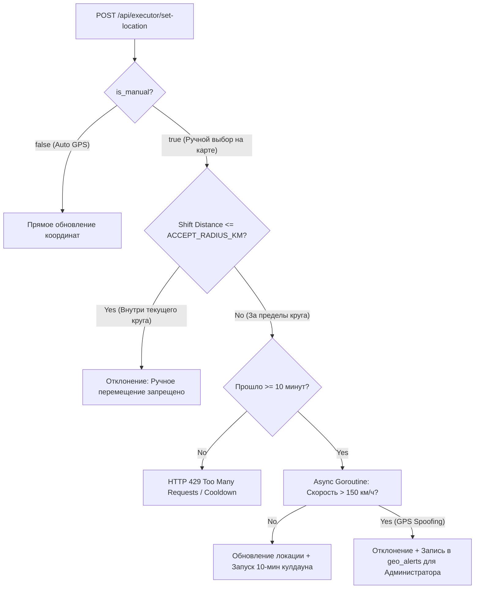

# Интерактивная карта заказов и гео-ограничения (Executor Map & Geofencing)

Документ подробно описывает бизнес-логику, архитектуру и техническую реализацию подсистемы интерактивной карты исполнителя и гео-ограничений (Geofencing).

---

## 1. Зонирование и Настройка Радиусов

1. **Зона обзора (10 км)**:
   - Исполнитель видит все активные заказы (`SEARCHING`) в радиусе **10 км** от своей рабочей геометки.
   - Маркеры заказов группируются на интерактивной карте Leaflet.
2. **Зона взятия заказа (`ACCEPT_RADIUS_KM`, по умолчанию 0.5 км / 500 м)**:
   - Радиус настраивается через переменную окружения `ACCEPT_RADIUS_KM` (по умолчанию `0.5`).
   - Взять заказ в работу (`POST /api/executor/orders/{id}/accept`) можно **только если координаты заказа находятся в радиусе $\le ACCEPT\_RADIUS\_KM$** от утвержденной метки исполнителя.
   - Заказы вне зоны взятия доступны для просмотра, но кнопка взятия заблокирована.

---

## 2. Правило смены рабочей локации, Кулдаун и Запрет внутренних перемещений

- **Запрет перемещения внутри круга ($\le ACCEPT\_RADIUS\_KM$)**: Ручные перемещения метки руками в пределах текущего разрешенного круга **запрещены**. Сервер отклоняет запрос с сообщением: *"Ручное перемещение разрешено только за пределы разрешенного круга"*.
- **Смена района ($> ACCEPT\_RADIUS\_KM$)**: Выход за пределы круга активирует 10-минутный кулдаун на следующую ручную смену района.
- **Горутина валидации аномалий**: Если физическая скорость перемещения превышает 150 км/ч, транзакция помечается как `GPS_SPOOFING`, отклоняется, а администратору отправляется предупреждение в лог `geo_alerts`.

---

## 3. Таблица эндпоинтов API Геолокации

| Метод | Эндпоинт | Описание | Доступ |
| :--- | :--- | :--- | :--- |
| `GET` | `/api/executor/map-orders` | Получить заказы в радиусе 10 км с флагом `can_accept` ($\le 2$ км) | `EXECUTOR` |
| `POST` | `/api/executor/set-location` | Установить геометку с проверкой кулдауна и аномалий | `EXECUTOR` |
| `GET` | `/api/admin/geo-alerts` | Список аномалий геолокации для администратора | `ADMIN` |
