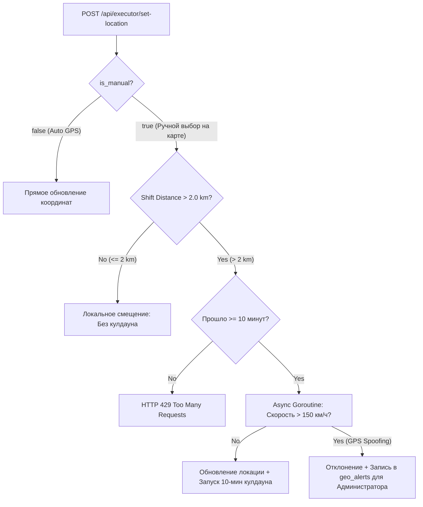

# Интерактивная карта заказов и гео-ограничения (Executor Map & Geofencing)

Документ подробно описывает бизнес-логику, архитектуру и техническую реализацию подсистемы интерактивной карты исполнителя и гео-ограничений (Geofencing).

---

## 1. Зонирование (10 км / 2 км)

1. **Зона обзора (10 км)**:
   - Исполнитель видит все активные заказы (`SEARCHING`) в радиусе **10 км** от своей рабочей геометки.
   - Маркеры заказов группируются на интерактивной карте Leaflet.
2. **Зона взятия заказа (2 км)**:
   - Взять заказ в работу (`POST /api/executor/orders/{id}/accept`) можно **только если координаты заказа находятся в радиусе $\le 2.0$ км** от утвержденной метки исполнителя.
   - Заказы в диапазоне от 2 до 10 км доступны для просмотра, но кнопка взятия заблокирована.

---

## 2. Правило смены рабочей локации и кулдаун 10 минут

- **Микро-перемещение ($\le 2.0$ км)**: Считается перемещением внутри текущей зоны и **не расходует 10-минутный кулдаун**.
- **Смена района ($> 2.0$ км)**: Активирует 10-минутный кулдаун на следующую ручную смену.
- **Горутина валидации аномалий**: Если физическая скорость перемещения превышает 150 км/ч, транзакция помечается как `GPS_SPOOFING`, отклоняется, а администратору отправляется предупреждение в лог `geo_alerts`.

---

## 3. Таблица эндпоинтов API Геолокации

| Метод | Эндпоинт | Описание | Доступ |
| :--- | :--- | :--- | :--- |
| `GET` | `/api/executor/map-orders` | Получить заказы в радиусе 10 км с флагом `can_accept` ($\le 2$ км) | `EXECUTOR` |
| `POST` | `/api/executor/set-location` | Установить геометку с проверкой кулдауна и аномалий | `EXECUTOR` |
| `GET` | `/api/admin/geo-alerts` | Список аномалий геолокации для администратора | `ADMIN` |
