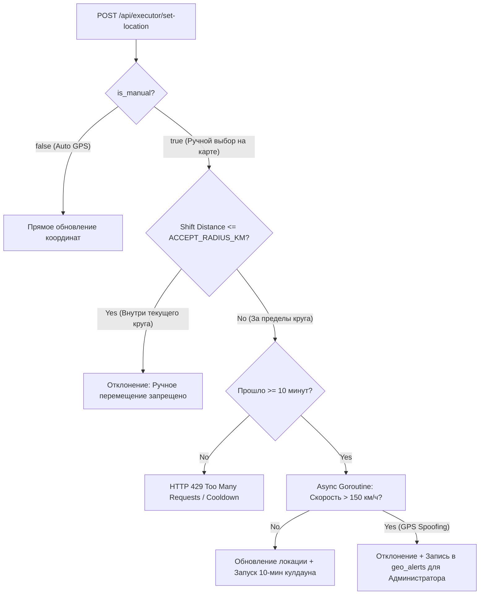

# Интерактивная карта заказов и гео-ограничения (Executor Map & Geofencing)

Документ подробно описывает бизнес-логику, архитектуру и техническую реализацию подсистемы интерактивной карты исполнителя и гео-ограничений (Geofencing).

---

## 1. Зонирование и Настройка Радиусов

1. **Зона обзора (10 км)**:
   - Исполнитель видит все активные заказы (`SEARCHING`) в радиусе **10 км** от своей рабочей геометки.
   - Маркеры заказов группируются на интерактивной карте Leaflet.
2. **Зона взятия заказа (`accept_radius_km`, по умолчанию 0.5 км / 500 м)**:
   - Радиус задаётся настройкой `accept_radius_km` в админке (Системные настройки). Если она не задана (пусто или `0`), действует переменная окружения `ACCEPT_RADIUS_KM`, а за ней умолчание `0.5`.
   - Взять заказ в работу (`POST /api/executor/orders/{id}/accept`) можно **только если координаты заказа находятся в радиусе $\le$ `accept_radius_km`** от утверждённой метки исполнителя. **Проверку делает сервер** (`OrderService.checkAcceptRadius`), поэтому её нельзя обойти ни прямым вызовом эндпоинта, ни экраном, который забыл спрятать кнопку.
   - Заказы вне зоны взятия доступны для просмотра, но кнопки взятия у них нет: и карта, и список «Заказы поблизости» скрывают её по флагу `can_accept`, который считает сервер.

> **История.** До сентября 2026 радиус жил только на клиенте: сервер расстояние
> не проверял вовсе, а список «Заказы поблизости» на дашборде показывал кнопку
> взятия безусловно на радиусе в 5 км. Заказ за пределами круга брался обычным
> нажатием. Регрессия закрыта тестами `TestAcceptRejectedOutsideRadius` и
> `TestAcceptAllowedInsideRadius`.

> **Не путать с автоподбором.** `auto_match_radius_km` (по умолчанию 10 км) —
> это то, как далеко платформа сама назначает заказ исполнителю; назначение идёт
> через `orderRepo.Assign` мимо `Accept` и зоной взятия не ограничено. Радиусы
> независимы: первый про «привезли работу», второй про «поехал сам».

---

## 2. Правило смены рабочей локации, Кулдаун и Запрет внутренних перемещений

- **Запрет перемещения внутри круга ($\le ACCEPT\_RADIUS\_KM$)**: Ручные перемещения метки руками в пределах текущего разрешенного круга **запрещены**. Сервер отклоняет запрос с сообщением: *"Ручное перемещение разрешено только за пределы разрешенного круга"*.
- **Смена района ($> ACCEPT\_RADIUS\_KM$)**: Выход за пределы круга активирует 10-минутный кулдаун на следующую ручную смену района.
- **Горутина валидации аномалий**: Если физическая скорость перемещения превышает 150 км/ч, транзакция помечается как `GPS_SPOOFING`, отклоняется, а администратору отправляется предупреждение в лог `geo_alerts`.

---

## 3. Таблица эндпоинтов API Геолокации

| Метод | Эндпоинт | Описание | Доступ |
| :--- | :--- | :--- | :--- |
| `GET` | `/api/executor/map-orders` | Заказы в радиусе 10 км с флагами `can_accept` и `distance_km` | `EXECUTOR` |
| `GET` | `/api/executor/orders/nearby` | То же для списка на дашборде: заказы в запрошенном радиусе, каждый с `can_accept` и `distance_km` | `EXECUTOR` |
| `POST` | `/api/executor/set-location` | Установить геометку с проверкой кулдауна и аномалий | `EXECUTOR` |
| `POST` | `/api/executor/orders/{id}/accept` | Взять заказ. Отказывает, если до заказа дальше `accept_radius_km` | `EXECUTOR` |
| `GET` | `/api/admin/geo-alerts` | Список аномалий геолокации для администратора | `ADMIN` |

Радиус поиска в `/orders/nearby` задаёт клиент (`radius`, до 50 км), и он
намеренно шире зоны взятия — список показывает окрестности. Что из показанного
можно взять, говорит `can_accept`, и только он совпадает с решением сервера.
