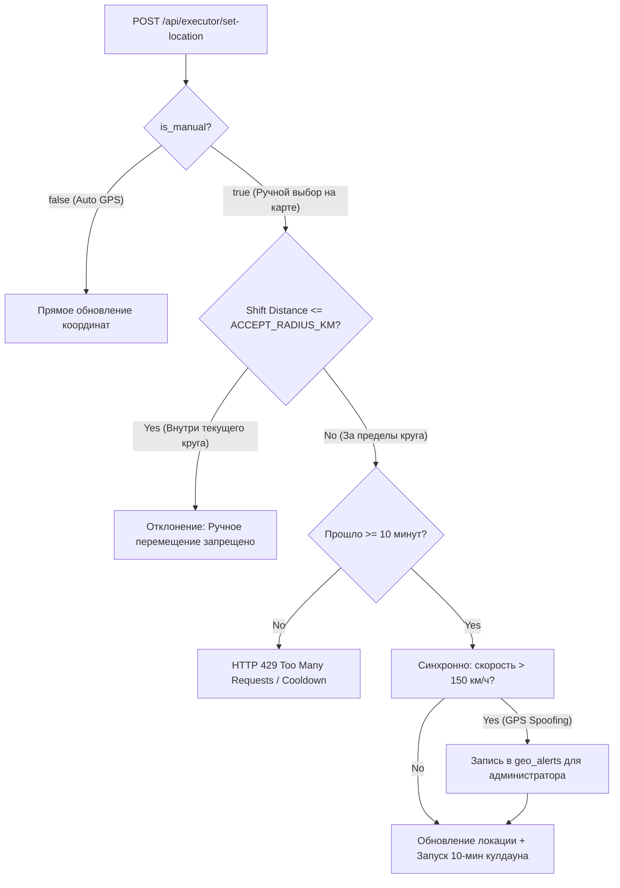

# Интерактивная карта заказов и гео-ограничения (Executor Map & Geofencing)

Документ подробно описывает бизнес-логику, архитектуру и техническую реализацию подсистемы интерактивной карты исполнителя и гео-ограничений (Geofencing).

---

## 1. Зонирование и Настройка Радиусов

1. **Зона обзора (`map_overview_radius_km`, по умолчанию 10 км)**:
   - Исполнитель видит все активные заказы (`SEARCHING`) в этом радиусе от своей рабочей геометки — и на карте, и в списке «Заказы поблизости».
   - Радиус задаётся в админке (Системные настройки → Гео и радиусы), максимум 50 км. Ниже радиуса взятия не опускается: показывать меньше, чем разрешено брать, бессмысленно.
   - Клиент радиус не выбирает. Раньше дашборд просил свои 5 км числом в запросе — из-за этого список и расходился с зоной взятия.
   - Маркеры заказов группируются на интерактивной карте Leaflet.
2. **Зона взятия заказа (`accept_radius_km`, по умолчанию 0.5 км / 500 м)**:
   - Радиус задаётся настройкой `accept_radius_km` в админке (Системные настройки → Гео и радиусы). Значение обязано быть положительным: ноль отвергается, иначе поле показывало бы 0, а действовало бы умолчание. Переменная окружения `ACCEPT_RADIUS_KM` осталась запасным вариантом для баз старше миграции 049.
   - Взять заказ в работу (`POST /api/executor/orders/{id}/accept`) можно **только если координаты заказа находятся в радиусе $\le$ `accept_radius_km`** от утверждённой метки исполнителя. **Проверку делает сервер** (`OrderService.checkAcceptRadius`), поэтому её нельзя обойти ни прямым вызовом эндпоинта, ни экраном, который забыл спрятать кнопку.
   - Заказы вне зоны взятия доступны для просмотра, но кнопки взятия у них нет: и карта, и список «Заказы поблизости» скрывают её по флагу `can_accept`, который считает сервер.

> **История.** До сентября 2026 радиус жил только на клиенте: сервер расстояние
> не проверял вовсе, а список «Заказы поблизости» на дашборде показывал кнопку
> взятия безусловно на радиусе в 5 км. Заказ за пределами круга брался обычным
> нажатием. Регрессия закрыта тестами `TestAcceptRejectedOutsideRadius` и
> `TestAcceptAllowedInsideRadius`.

> **Не путать с автоподбором.** `auto_match_radius_km` (по умолчанию 10 км) —
> это то, как далеко платформа сама назначает заказ исполнителю; назначение идёт
> через `orderRepo.Assign` мимо `Accept` и зоной взятия не ограничено. Радиусы
> независимы: первый про «привезли работу», второй про «поехал сам».

---

## 2. Правило смены рабочей локации, Кулдаун и Запрет внутренних перемещений

```mermaid
flowchart TD
    A[POST /api/executor/set-location] --> B{is_manual?}
    B -- false (Auto GPS) --> C[Прямое обновление координат]
    B -- true (Ручной выбор на карте) --> D{Shift Distance <= ACCEPT_RADIUS_KM?}
    
    D -- Yes (Внутри текущего круга) --> E[Отклонение: Ручное перемещение запрещено]
    D -- No (За пределы круга) --> F{Прошло >= 10 минут?}
    
    F -- No --> G[HTTP 429 Too Many Requests / Cooldown]
    F -- Yes --> H[Синхронно: скорость > 150 км/ч?]
    
    H -- No --> I[Обновление локации + Запуск 10-мин кулдауна]
    H -- Yes (GPS Spoofing) --> J[Запись в geo_alerts для администратора]
    J --> I
```

- **Запрет перемещения внутри круга ($\le ACCEPT\_RADIUS\_KM$)**: Ручные перемещения метки руками в пределах текущего разрешенного круга **запрещены**. Сервер отклоняет запрос с сообщением: *"Ручное перемещение разрешено только за пределы разрешенного круга"*.
- **Смена района ($> ACCEPT\_RADIUS\_KM$)**: Выход за пределы круга активирует 10-минутный кулдаун на следующую ручную смену района.
- **Проверка аномалий** выполняется синхронно, до записи позиции (раньше — в горутине на контексте запроса, который отменялся сразу после ответа, и запись алерта терялась с `context canceled`). Если скорость перемещения больше 150 км/ч при сдвиге больше 2 км, в `geo_alerts` пишется предупреждение — след подделки GPS для карточки доказательств арбитража. Перемещение при этом не отклоняется: алерт — наблюдение, а не запрет; сбой его записи только логируется.
- Считается ли перемещение ручным, решает сервер по пройденному расстоянию (`shiftDist > accept_radius_km`), а не только флаг `is_manual` клиента.

---

## 3. Таблица эндпоинтов API Геолокации

| Метод | Эндпоинт | Описание | Доступ |
| :--- | :--- | :--- | :--- |
| `GET` | `/api/executor/map-orders` | Заказы в радиусе обзора с флагами `can_accept` и `distance_km`. `409` — рабочая позиция не задана; пустой результат — `[]`, а не `null` | `EXECUTOR` |
| `GET` | `/api/executor/orders/nearby` | То же для списка на дашборде: заказы в радиусе обзора, каждый с `can_accept` и `distance_km` | `EXECUTOR` |
| `POST` | `/api/executor/set-location` | Установить геометку с проверкой кулдауна и аномалий. `422` — негодные координаты, `429` — кулдаун | `EXECUTOR` |
| `POST` | `/api/executor/follow-device` | Вести метку по GPS устройства. `422` — негодные координаты | `EXECUTOR` |
| `GET` | `/api/executor/location` | Текущая метка. Сбой — `500` | `EXECUTOR` |
| `POST` | `/api/executor/orders/{id}/accept` | Взять заказ. `409`, если до заказа дальше `accept_radius_km` | `EXECUTOR` |
| `GET` | `/api/admin/geo-alerts` | Список аномалий геолокации | право `shifts.view` (в том числе модератор) |

Радиус в `/orders/nearby` задаёт сервер (`map_overview_radius_km`), а не запрос:
параметр `radius` больше не читается, установленные APK шлют его вхолостую. Он
намеренно шире зоны взятия — список показывает окрестности. Что из показанного
можно взять, говорит `can_accept`, и только он совпадает с решением сервера.
