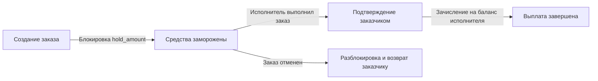

# Финансовая система, балансы и тарифная сетка (Financial System & Tariffs)

Документ описывает движение финансовых средств, структуру тарифной сетки, холдирование и выплаты.

---

## 1. Концепция внутреннего баланса

- Все финансовые операции проходят через внутренний кошелек пользователя (`balance`).
- Предоплатная система: заказчик обязан иметь достаточную сумму на балансе для оформления заказа.
- В текущей версии пополнение баланса осуществляется подачей заявки администратору (`TOPUP`).

---

## 2. Жизненный цикл средств по заказу



1. **Создание заказа**: Расчитывается стоимость `price`. Сумма холдируется (`balance -= price`, `hold_amount += price`).
2. **Завершение заказа**: При подтверждении заказа средства перечисляются с холда заказчика на баланс исполнителя (`executor.balance += price`).
3. **Отмена заказа**: Если заказ отменяется (`CANCELED`), списанный холд в полном объеме возвращается на баланс заказчика.

---

## 3. Тарифная сетка

| Тип тарифа | Коэффициент | Описание |
| :--- | :--- | :--- |
| `STANDARD` | `×1.0` | Стандартный вывоз мусора |
| `INCREASED` | `×2.0` | Увеличенный объем мусора (настраивается в админке `tariff_increased_mult`) |
| `URGENT` | `×3.0` | Срочный выезд в течение 1 часа (настраивается `tariff_urgent_mult`) |
| `ASAP` | `×8.0` | Немедленный выезд в течение 15 минут (настраивается `tariff_asap_mult`) |
| `CONSTRUCTION` | Аукцион | Договорная стоимость по ставкам исполнителей |

---

## 4. Финансовые транзакции

Каждая финансовая операция фиксируется в таблице `transactions`:

- `TOPUP` — пополнение баланса администратором.
- `ORDER_HOLD` — заморозка средств при оформлении заказа.
- `ORDER_PAYOUT` — выплата исполнителю за выполненный заказ.
- `ORDER_REFUND` — возврат средств при отмене заказа.
- `PENALTY` — списание штрафа за нарушение геозоны или досрочный сход со смены.

---

## 4a. Чаевые исполнителю

После завершённого заказа заказчик может оставить исполнителю чаевые — прямо
в окне оценки заказа (см. [rating_system_and_order_lifecycle.md](rating_system_and_order_lifecycle.md)).
В интерфейсе доступны быстрые кнопки **5 %** и **10 %** от суммы заказа и поле
для произвольной суммы; списывается сумма с баланса заказчика.

Движение денег повторяет схему заказа и проходит через счёт `ESCROW` в одной
транзакции, поэтому книги остаются сведёнными. Два типа транзакций описывают
две стороны:

| Тип | Сторона | Знак | Смысл |
| :--- | :--- | :--- | :--- |
| `TIP` | заказчик | `-1` | сумма чаевых списывается с баланса заказчика (только если её хватает) |
| `TIP_REWARD` | исполнитель | `+1` | та же сумма зачисляется исполнителю |

Внутри одной транзакции `TIP` кредитует `ESCROW`, а `TIP_REWARD` тут же его
дебетует — на счёте `ESCROW` пара даёт ноль, дрейфа эскроу чаевые не создают.

Правила (эндпоинт `POST /customer/orders/{id}/tip`, тело `{ "amount": <рубли> }`):

- заказ должен быть `COMPLETED` и принадлежать этому заказчику, у него должен
  быть исполнитель;
- сумма положительная и не больше защитного потолка (100 000 ₽ — предохранитель
  от опечатки; реальный лимит — баланс заказчика);
- чаевые начисляются **не более одного раза** на заказ: проверка наличия строки
  `TIP` и само списание идут в одной транзакции под блокировкой заказа, поэтому
  повторный запрос не спишет дважды;
- при нехватке средств возвращается `422` «недостаточно средств», как и на
  удержании по заказу.

---

## Сверка в админке

`GET /admin/finances/reconciliation` отдаёт полный отчёт, экран — «Сверка» в меню администратора ([`FinancialReconciliation.vue`](../frontend/src/pages/admin/FinancialReconciliation.vue)).

Показывается закрывающая позиция: сколько денег у пользователей, сколько на системных счетах и **разница между ними**. Сумма обязана быть нулём — у каждого движения две стороны. Ненулевая разница означает, что где-то прошла односторонняя операция, и чинить надо её, а не баланс.

Ниже — разбивка по счетам (`DEPOSITS`, `ESCROW`, `FINES`, `PAYOUTS`), сопоставление эскроу с суммой активных заказов и списки находок: разошедшиеся балансы и заказы с зависшим удержанием. Списки находок показываются только когда они непустые: пустая таблица читается как «ничего не проверяли», а не как «всё в порядке».

## Односторонние движения: чего больше нет

`Ledger` вводился как единственный путь для денег, но три места ходили сырым SQL мимо него — меняли баланс пользователя и писали строку в `transactions`, не трогая системный счёт. Персональная сверка при этом сходилась (`0 balance mismatches`), а книги платформы расходились всё сильнее. Ровно это и показал боевой отчёт 27.08.2026: расхождение на 300 ₽ при нулевых расхождениях по пользователям.

| Было | Стало |
| :--- | :--- |
| `AuctionWorker.cancelAuction` — свой SQL: кредитовал заказчика, не дебетовал ESCROW, не обнулял `hold_amount` | Вызывает `OrderService.CancelUnclaimedAuction` — единственный корректный путь отмены |
| `SLAWorker.downgradeOrder` — возврат разницы прямым UPDATE | `Ledger.Release` из `ESCROW` |
| `adminRepo.TopUpUserBalance` — прямое пополнение | `Ledger.Deposit`, а сырой метод удалён из репозитория и из интерфейса |

Последнее важно отдельно: метод не просто перестали звать, его **больше нет**, поэтому вернуться к нему случайно нельзя.

Инвариант закреплён тестами в [`books_regression_test.go`](../backend/service/books_regression_test.go): каждый из трёх сценариев проверяет, что сумма балансов пользователей и системных счетов не изменилась. Проверено, что тест действительно ловит односторонний кредит, а не просто зелёный.

> Исторические строки эти правки **не чинят** — они останавливают течь. Что делать с уже накопленным расхождением, решается отдельно: сверка сознательно только сообщает и никогда не правит, потому что разница — чьи-то деньги.

> **Про аукционы отдельно.** Заявка на строительный мусор публикуется **без цены**, и деньги удерживаются только в момент принятия ставки — см. [`bids_and_auction.md`](./bids_and_auction.md). Значит семидневная зачистка видит только заказы в `SEARCHING`, у которых удержания нет вовсе, и ветка возврата в старом воркере была фактически мёртвым кодом. Зависшие удержания на `CANCELED` он породить не мог — это наследие, как и на `COMPLETED`.
>
> Отсюда же `CancelUnclaimedAuction` вместо `CancelOrder`: между выборкой просроченных заявок и отменой заказчик может принять ставку, а это переводит заказ в `ASSIGNED` и двигает деньги в эскроу. Отменять его тогда — значит забрать работу у исполнителя, который её только что выиграл, из-за скана, начавшегося парой секунд раньше. Отменяется только то, что никто не забрал.

## Разовый ремонт книг

[`backend/scripts/repair_books_gap.sql`](../backend/scripts/repair_books_gap.sql) — не миграция и **не применяется автоматически**: правку денежного журнала запускает человек, глядя на вывод.

Чинится только **сторона счетов**. Сторона пользователя уже верна — сверка показывает ноль расхождений по балансам, то есть каждый баланс сходится с собственным журналом операций. Ещё одна строка в `transactions` сломала бы это согласие: она начислила бы пользователю второй раз на бумаге. Не хватает именно текущего итога на `system_accounts`.

Сумму скрипт не берёт из воздуха: он находит границу эр по данным (первая запись, которую сделал ledger), собирает односторонние записи после неё, раскладывает их по счетам согласно соглашению о знаках из [`transaction.go`](../backend/repository/transaction.go) и **отказывается коммитить**, если арифметика не сходится ровно. Проверено на всех четырёх ветках:

| Ситуация | Поведение |
| :--- | :--- |
| Разрыв есть, односторонних записей нет | отказ — причина там, куда скрипт не смотрит |
| Односторонние объясняют не весь разрыв | отказ — не угадывает разницу |
| Книги уже сходятся | отказ — чинить нечего |
| Разрыв ровно равен односторонним | чинит, затем сверяет инвариант и падает, если тот не ноль |

Тип операции без сопоставленного счёта тоже приводит к отказу: угадывать, куда положить настоящие деньги, скрипт не будет.

Запускать так, читая вывод до коммита:

```
BEGIN;
\i scripts/repair_books_gap.sql
COMMIT;   -- или ROLLBACK
```
