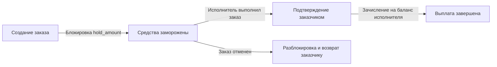

# Финансовая система, балансы и тарифная сетка (Financial System & Tariffs)

Документ описывает движение финансовых средств, структуру тарифной сетки, холдирование и выплаты.

---

## 1. Концепция внутреннего баланса

- Все финансовые операции проходят через внутренний кошелек пользователя (`balance`).
- Предоплатная система: заказчик обязан иметь достаточную сумму на балансе для оформления заказа.
- В текущей версии пополнение баланса осуществляется подачей заявки администратору (`TOPUP`).

---

## 2. Жизненный цикл средств по заказу

1. **Создание заказа**: Расчитывается стоимость `price`. Сумма холдируется (`balance -= price`, `hold_amount += price`).
2. **Завершение заказа**: При подтверждении заказа средства перечисляются с холда заказчика на баланс исполнителя (`executor.balance += price`).
3. **Отмена заказа**: Если заказ отменяется (`CANCELED`), списанный холд в полном объеме возвращается на баланс заказчика.

---

## 3. Тарифная сетка

| Тип тарифа | Коэффициент | Описание |
| :--- | :--- | :--- |
| `STANDARD` | `×1.0` | Стандартный вывоз мусора |
| `INCREASED` | `×2.0` | Увеличенный объем мусора (настраивается в админке `tariff_increased_mult`) |
| `URGENT` | `×3.0` | Срочный выезд в течение 1 часа (настраивается `tariff_urgent_mult`) |
| `ASAP` | `×8.0` | Немедленный выезд в течение 15 минут (настраивается `tariff_asap_mult`) |
| `CONSTRUCTION` | Аукцион | Договорная стоимость по ставкам исполнителей |

---

## 4. Финансовые транзакции

Каждая финансовая операция фиксируется в таблице `transactions`:

- `TOPUP` — пополнение баланса администратором.
- `ORDER_HOLD` — заморозка средств при оформлении заказа.
- `ORDER_PAYOUT` — выплата исполнителю за выполненный заказ.
- `ORDER_REFUND` — возврат средств при отмене заказа.
- `PENALTY` — списание штрафа за нарушение геозоны или досрочный сход со смены.
