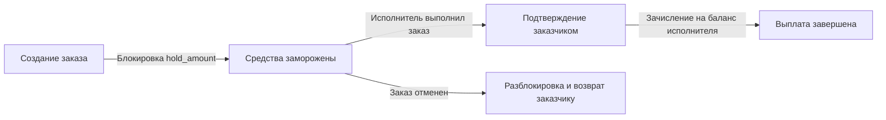

# Финансовая система, балансы и тарифная сетка (Financial System & Tariffs)

Документ описывает движение финансовых средств, структуру тарифной сетки, холдирование и выплаты.

---

## 1. Концепция внутреннего баланса

- Все финансовые операции проходят через внутренний кошелек пользователя (`balance`).
- Предоплатная система: заказчик обязан иметь достаточную сумму на балансе для оформления заказа.
- В текущей версии пополнение баланса осуществляется подачей заявки администратору (`TOPUP`).

---

## 2. Жизненный цикл средств по заказу



1. **Создание заказа**: Расчитывается стоимость `price`. Сумма холдируется (`balance -= price`, `hold_amount += price`).
2. **Завершение заказа**: При подтверждении заказа средства перечисляются с холда заказчика на баланс исполнителя (`executor.balance += price`).
3. **Отмена заказа**: Если заказ отменяется (`CANCELED`), списанный холд в полном объеме возвращается на баланс заказчика.

---

## 3. Тарифная сетка

| Тип тарифа | Коэффициент | Описание |
| :--- | :--- | :--- |
| `STANDARD` | `×1.0` | Стандартный вывоз мусора |
| `INCREASED` | `×2.0` | Увеличенный объем мусора (настраивается в админке `tariff_increased_mult`) |
| `URGENT` | `×3.0` | Срочный выезд в течение 1 часа (настраивается `tariff_urgent_mult`) |
| `ASAP` | `×8.0` | Немедленный выезд в течение 15 минут (настраивается `tariff_asap_mult`) |
| `CONSTRUCTION` | Аукцион | Договорная стоимость по ставкам исполнителей |

---

## 4. Финансовые транзакции

Каждая финансовая операция фиксируется в таблице `transactions`:

- `TOPUP` — пополнение баланса администратором.
- `ORDER_HOLD` — заморозка средств при оформлении заказа.
- `ORDER_PAYOUT` — выплата исполнителю за выполненный заказ.
- `ORDER_REFUND` — возврат средств при отмене заказа.
- `PENALTY` — списание штрафа за нарушение геозоны или досрочный сход со смены.

---

## 4a. Чаевые исполнителю

После завершённого заказа заказчик может оставить исполнителю чаевые — прямо
в окне оценки заказа (см. [rating_system_and_order_lifecycle.md](rating_system_and_order_lifecycle.md)).
В интерфейсе доступны быстрые кнопки **5 %** и **10 %** от суммы заказа и поле
для произвольной суммы; списывается сумма с баланса заказчика.

Движение денег повторяет схему заказа и проходит через счёт `ESCROW` в одной
транзакции, поэтому книги остаются сведёнными. Два типа транзакций описывают
две стороны:

| Тип | Сторона | Знак | Смысл |
| :--- | :--- | :--- | :--- |
| `TIP` | заказчик | `-1` | сумма чаевых списывается с баланса заказчика (только если её хватает) |
| `TIP_REWARD` | исполнитель | `+1` | та же сумма зачисляется исполнителю |

Внутри одной транзакции `TIP` кредитует `ESCROW`, а `TIP_REWARD` тут же его
дебетует — на счёте `ESCROW` пара даёт ноль, дрейфа эскроу чаевые не создают.

Правила (эндпоинт `POST /customer/orders/{id}/tip`, тело `{ "amount": <рубли> }`):

- заказ должен быть `COMPLETED` и принадлежать этому заказчику, у него должен
  быть исполнитель;
- сумма положительная и не больше защитного потолка (100 000 ₽ — предохранитель
  от опечатки; реальный лимит — баланс заказчика);
- чаевые начисляются **не более одного раза** на заказ: проверка наличия строки
  `TIP` и само списание идут в одной транзакции под блокировкой заказа, поэтому
  повторный запрос не спишет дважды;
- при нехватке средств возвращается `422` «недостаточно средств», как и на
  удержании по заказу.

---

## 4b. Комиссия платформы

С каждого **выполненного** заказа платформа удерживает долю от суммы, которую
фактически заплатил заказчик. Исполнитель получает вознаграждение за вычетом
этой доли; заказчик платит ровно столько же, сколько платил бы без комиссии —
она берётся не сверху, а из выплаты.

Ставка — ключ `order_commission_percent` в `system_settings`, редактируется на
экране «Системные настройки» (карточка «Тарификация и коэффициенты»). Значение
в процентах, допускается дробное; валидатор `AdminService.UpdateSettings`
принимает только `0..100`, а `commissionOn` в сервисе заказов ограничивает
диапазон ещё раз — доля больше 100 % означала бы отрицательное вознаграждение.
По умолчанию `0`: миграция не меняет ничьи выплаты, пока админ не задаст ставку.

Удержанное копится на отдельном системном счёте `COMMISSION`. Движение проходит
внутри той же транзакции, что и подтверждение заказа, поэтому эскроу по заказу
по-прежнему обнуляется ровно:

```
hold_amount = возврат заказчику + COMMISSION + вознаграждение исполнителю
```

| Тип | Счёт | Знак | Смысл |
| :--- | :--- | :--- | :--- |
| `COMMISSION` | `ESCROW` → `COMMISSION` | `0` | доля платформы при подтверждении заказа |
| `COMMISSION_PAYOUT` | `COMMISSION` → `DEPOSITS` | `0` | админ вывел накопленное из системы |

Знак `0` у обоих: движение идёт между двумя системными счетами и баланс
пользователя не трогает. Запись всё равно делается «на пользователя» — на
исполнителя, из чьей выплаты удержано, и на админа, который вывел, — чтобы
операцию можно было найти в журнале. Округление одно и живёт в `Amount.Scale`;
остаток от округления достаётся исполнителю.

Чаевые комиссией не облагаются: они идут мимо эскроу заказа, напрямую от
заказчика исполнителю.

### Просмотр и вывод

Экран — «Комиссия платформы» в меню администратора
([`PlatformCommission.vue`](../frontend/src/pages/admin/PlatformCommission.vue)):
показывает накопленный остаток счёта и действующую ставку.

| Эндпоинт | Что делает |
| :--- | :--- |
| `GET /admin/finances/commission` | остаток счёта `COMMISSION` и текущая ставка |
| `POST /admin/finances/commission/payout` | вывод: тело `{ "amount": <рубли> }` |

Оба маршрута лежат в группе за `RequireAuth` + `RequireAdmin`, поэтому вывести
комиссию может только администратор; его идентификатор пишется в `admin_id`
записи `COMMISSION_PAYOUT`, так что у каждого вывода есть имя.

Списание идёт через `Ledger.Payout`, а не `Settle`: сумму называет вызывающий,
и дебет счёта защищён условием `balance >= amount` в том же `UPDATE`, который
двигает деньги. Два одновременных вывода не могут вместе забрать больше, чем
собрано, а счёт не уходит в минус. При попытке вывести больше остатка
возвращается `400` с текстом про нехватку средств.

---

## 4c. Вознаграждения от платформы (счёт `BONUSES`)

Скриптовое поведение услуги может назначить исполнителю вознаграждение за работу,
которую заказчик не оплачивал: так устроена бесплатная услуга верификации —
заказчик не платит ничего, а модератору, подтвердившему личность, платформа
платит фиксированную сумму. См. [`service_behaviors.md`](./service_behaviors.md).

Такие деньги не могут выйти из `ESCROW`: там лежит только то, что внёс заказчик.
Для них заведён отдельный системный счёт:

| Тип | Счёт | Знак | Смысл |
| :--- | :--- | :--- | :--- |
| `BONUS` | `BONUSES` → пользователь | `+1` | вознаграждение, выплаченное платформой |

`BONUSES` уходит в минус ровно на выплаченную сумму — так же, как `DEPOSITS`
представляет внешний мир. Этот минус и есть накопленный расход платформы на
вознаграждения; книги сходятся, потому что кредит пользователю и дебет счёта —
одно движение внутри одной транзакции.

Дебет `BONUSES` не ограничен остатком: это счёт расходов, а не кошелёк, и пустой
остаток не должен мешать выплатить первое вознаграждение. Ограничение здесь
другое — потолок одной выплаты `behavior_max_bonus` (по умолчанию 5000 ₽,
редактируется в системных настройках). Выплата выше потолка не проводится, а
событие остаётся необработанным, то есть видимым.

**Комиссия на вознаграждения не распространяется** — если поведение не включило
её явно. Комиссия платформы это её доля от того, что заплатил заказчик; за
бесплатную услугу не платил никто, и удержание с собственной выплаты
перекладывало бы деньги платформы с `BONUSES` на `COMMISSION` и обратно ничего не
меняя. Поведение, которое считает свои вознаграждения обычным заработком,
включает удержание константой `APPLY_COMMISSION` в своём `config.star` (или
ключом `apply_commission` у узла). Ставка при этом та же —
`order_commission_percent`, и брутто делится точно:

```
BONUSES −брутто = пользователь +(брутто − комиссия) + COMMISSION +комиссия
```

Вознаграждение может получать и исполнитель, и заказчик: суммы задаются
константами поведения (`REWARD_EXECUTOR`, `REWARD_CUSTOMER`), у каждой выплаты
свой ключ идемпотентности.

## 4d. Споры с неизвестным исходом (счёт `DISPUTES`)

Когда арбитр решает спор как «неизвестно», обе стороны получают своё целиком:
заказчику возвращается всё удержанное, исполнитель получает оплату, как за
подтверждённый заказ, по своей обычной ставке комиссии. Заказчик за заказ не
заплатил, поэтому выплату финансирует счёт платформы `DISPUTES`
(`Ledger.SettleUnknownDispute`):

```
ESCROW   −удержание = заказчик +удержание                             (REFUND)
DISPUTES −выплата   = исполнитель +(выплата − комиссия)               (DISPUTE_REWARD)
                    + COMMISSION +комиссия                            (COMMISSION)
```

| Тип | Счёт | Знак | Смысл |
| :--- | :--- | :--- | :--- |
| `DISPUTE_REWARD` | `DISPUTES` → исполнитель | `+1` | оплата исполнителю по спору с неизвестным исходом |

- Выплата — та же сумма, что при обычном подтверждении (удержание, а для
  просроченного ASAP — сниженный тариф), комиссия — по ставке и уровню
  исполнителя; ставка и уровень записываются в заказ.
- Заказ становится `COMPLETED`, удержание обнуляется. Событие `order.confirmed`
  не публикуется: заказчик выполнение не подтверждал.
- `DISPUTES`, как и `BONUSES`, — счёт расходов: уходит в минус, и этот минус —
  во что обошлись неразрешимые споры. Дебет не ограничен остатком.
- Выплата со счёта расходов с долей комиссии у бонуса и у спора одна:
  `Ledger.payFromPlatform`.

## 4e. Магазин (счёт `SHOP`)

Покупка в магазине — дебет с проверкой баланса на счёт выручки `SHOP`
(`Ledger.ShopCharge`, купить в долг нельзя), отмена покупки администратором —
возврат со счёта (`Ledger.ShopRefund`, дебет счёта не охраняется: если выручку
уже вывели, `SHOP` уходит в минус), вывод выручки — `SHOP → DEPOSITS` с
охраной остатка (`Ledger.ShopPayout`, по образцу вывода комиссии).

| Тип | Счёт | Знак | Смысл |
| :--- | :--- | :--- | :--- |
| `SHOP_PURCHASE` | покупатель → `SHOP` | `-1` | оплата покупки |
| `SHOP_REFUND` | `SHOP` → покупатель | `+1` | возврат при отмене |
| `SHOP_PAYOUT` | `SHOP` → `DEPOSITS` | `0` | администратор вывел выручку |

Проводки магазина ссылаются на покупку (`transactions.shop_order_id`), поэтому
карточка покупки показывает свою оплату и возвраты. Комиссия с продаж магазина
не берётся. Привилегии магазина снижают комиссию с заказов через `Levels.For`
(см. [`achievements.md`](./achievements.md#5-уровни-и-комиссия)). Подробно —
[`shop.md`](./shop.md).

---

## Сверка в админке

`GET /admin/finances/reconciliation` отдаёт полный отчёт, экран — «Сверка» в меню администратора ([`FinancialReconciliation.vue`](../frontend/src/pages/admin/FinancialReconciliation.vue)).

Показывается закрывающая позиция: сколько денег у пользователей, сколько на системных счетах и **разница между ними**. Сумма обязана быть нулём — у каждого движения две стороны. Ненулевая разница означает, что где-то прошла односторонняя операция, и чинить надо её, а не баланс.

Ниже — разбивка по счетам (`DEPOSITS`, `ESCROW`, `FINES`, `PAYOUTS`, `COMMISSION`, `BONUSES`), сопоставление эскроу с суммой активных заказов и списки находок: разошедшиеся балансы и заказы с зависшим удержанием. Списки находок показываются только когда они непустые: пустая таблица читается как «ничего не проверяли», а не как «всё в порядке».

## Односторонние движения: чего больше нет

`Ledger` вводился как единственный путь для денег, но три места ходили сырым SQL мимо него — меняли баланс пользователя и писали строку в `transactions`, не трогая системный счёт. Персональная сверка при этом сходилась (`0 balance mismatches`), а книги платформы расходились всё сильнее. Ровно это и показал боевой отчёт 27.08.2026: расхождение на 300 ₽ при нулевых расхождениях по пользователям.

| Было | Стало |
| :--- | :--- |
| `AuctionWorker.cancelAuction` — свой SQL: кредитовал заказчика, не дебетовал ESCROW, не обнулял `hold_amount` | Вызывает `OrderService.CancelUnclaimedAuction` — единственный корректный путь отмены |
| `SLAWorker.downgradeOrder` — возврат разницы прямым UPDATE | `Ledger.Release` из `ESCROW` |
| `adminRepo.TopUpUserBalance` — прямое пополнение | `Ledger.Deposit`, а сырой метод удалён из репозитория и из интерфейса |

Последнее важно отдельно: метод не просто перестали звать, его **больше нет**, поэтому вернуться к нему случайно нельзя.

Инвариант закреплён тестами в [`books_regression_test.go`](../backend/service/books_regression_test.go): каждый из трёх сценариев проверяет, что сумма балансов пользователей и системных счетов не изменилась. Проверено, что тест действительно ловит односторонний кредит, а не просто зелёный.

Односторонняя проводка видна и по самой строке: каждая запись `Ledger` называет счёт по другую сторону, и с миграции `060` он попадает в `transactions.counterparty` ([`CreateTransaction`](../backend/repository/transaction.go), пустая строка — `NULL`). Строка без счёта после этой границы записана мимо `Ledger`. До неё столбец терялся у всех строк, поэтому `NULL` там ничего не доказывает — подробности в [«Разовом ремонте книг»](#граница-откуда-counterparty--доказательство). Запись счёта охраняют `TestCreateTransactionWritesCounterparty` (обе ветки — в транзакции и без неё, пустой счёт → `NULL`) и `TestLedgerRecordsCounterpartyIntegration` (проводки `Ledger` на настоящем Postgres).

> Исторические строки эти правки **не чинят** — они останавливают течь. Что делать с уже накопленным расхождением, решается отдельно: сверка сознательно только сообщает и никогда не правит, потому что разница — чьи-то деньги.

> **Про аукционы отдельно.** Заявка на строительный мусор публикуется **без цены**, и деньги удерживаются только в момент принятия ставки — см. [`bids_and_auction.md`](./bids_and_auction.md). Значит семидневная зачистка видит только заказы в `SEARCHING`, у которых удержания нет вовсе, и ветка возврата в старом воркере была фактически мёртвым кодом. Зависшие удержания на `CANCELED` он породить не мог — это наследие, как и на `COMPLETED`.
>
> Отсюда же `CancelUnclaimedAuction` вместо `CancelOrder`: между выборкой просроченных заявок и отменой заказчик может принять ставку, а это переводит заказ в `ASSIGNED` и двигает деньги в эскроу. Отменять его тогда — значит забрать работу у исполнителя, который её только что выиграл, из-за скана, начавшегося парой секунд раньше. Отменяется только то, что никто не забрал.

## Разовый ремонт книг

[`backend/scripts/repair_books_gap.sql`](../backend/scripts/repair_books_gap.sql) — не миграция и **не применяется автоматически**: правку денежного журнала запускает человек, глядя на вывод.

Чинится только **сторона счетов**. Сторона пользователя уже верна — сверка показывает ноль расхождений по балансам, то есть каждый баланс сходится с собственным журналом операций. Ещё одна строка в `transactions` сломала бы это согласие: она начислила бы пользователю второй раз на бумаге. Не хватает именно текущего итога на `system_accounts`.

Сумму скрипт не берёт из воздуха: он берёт границу из `schema_migrations` (момент применения миграции `060`, см. ниже), собирает односторонние записи после неё — строки без `counterparty`, раскладывает их по счетам согласно соглашению о знаках из [`transaction.go`](../backend/repository/transaction.go) и **отказывается коммитить**, если арифметика не сходится ровно. Проверено на всех четырёх ветках:

| Ситуация | Поведение |
| :--- | :--- |
| Разрыв есть, односторонних записей нет | отказ — причина там, куда скрипт не смотрит |
| Односторонние объясняют не весь разрыв | отказ — не угадывает разницу |
| Книги уже сходятся | отказ — чинить нечего |
| Разрыв ровно равен односторонним | чинит, затем сверяет инвариант и падает, если тот не ноль |

Тип операции без сопоставленного счёта тоже приводит к отказу: угадывать, куда положить настоящие деньги, скрипт не будет.

### Граница: откуда `counterparty` — доказательство

`Ledger.record` с самого начала заполнял `Transaction.Counterparty`, но `CreateTransaction` не перечислял столбец в `INSERT`, поэтому от миграции `029` до выхода правки `NULL` стоял у **всех** строк, включая двусторонние проводки самого `Ledger`. Отсюда три эры:

| Эра | Граница | Что значит `counterparty IS NULL` |
| :--- | :--- | :--- |
| до ledger | до `029` | правда: счетов не было, `029` поглотила всю историю одной суммой в `DEPOSITS` |
| не классифицируется | `029` … `060` | ничего: так выглядят и проводки `Ledger`, и сырой SQL, исправленный 27.08 |
| двусторонняя | с `060` | проводка прошла мимо `Ledger` |

Обе границы — `applied_at` строк `029_system_accounts.sql` и `060_transaction_counterparty.sql` в `schema_migrations`. Раннер записывает их сам в момент применения, а `060` вышла в том же релизе, что и запись столбца, и применяется на старте до того, как процесс начнёт писать проводки. Раньше граница выводилась из данных — `MIN(created_at) WHERE counterparty IS NOT NULL`, — но столбец заполнял только сам ремонт, так что без ремонта скрипт отказывался («ни одна проводка никогда не записывала счёт»), а после ремонта граница уезжала на отремонтированные строки, и каждая законная проводка после них выглядела бы односторонней.

Строки `029`…`060` скрипт не разбирает и печатает только их число. Разрыв, открытый в этом окне, приводит к отказу «ни одна односторонняя запись его не объясняет»; дальше — [`locate_books_gap.sql`](../backend/scripts/locate_books_gap.sql), который первой таблицей печатает обе границы и число строк в каждой эре, а затем сверяет счета с их собственными определениями.

**Обратного заполнения нет сознательно.** До `029` `NULL` верен. В окне `029`…`060` проставить счёт по типу технически можно — у типов, которые чинит скрипт, счёт однозначный (`TOP_UP` → `DEPOSITS`, `HOLD`/`REFUND`/`REWARD` → `ESCROW`, `FINE` → `FINES`, `WITHDRAWAL_HOLD` → `PAYOUTS`), — но это пометило бы как учтённые ровно те односторонние строки, которые ремонт ищет, и связь «есть счёт — сторона счёта двигалась» перестала бы быть правдой. Балансы и суммы миграция `060` не трогает: она только комментирует столбец и служит отметкой времени.

Запускать так, читая вывод до коммита:

```
BEGIN;
\i scripts/repair_books_gap.sql
COMMIT;   -- или ROLLBACK
```
