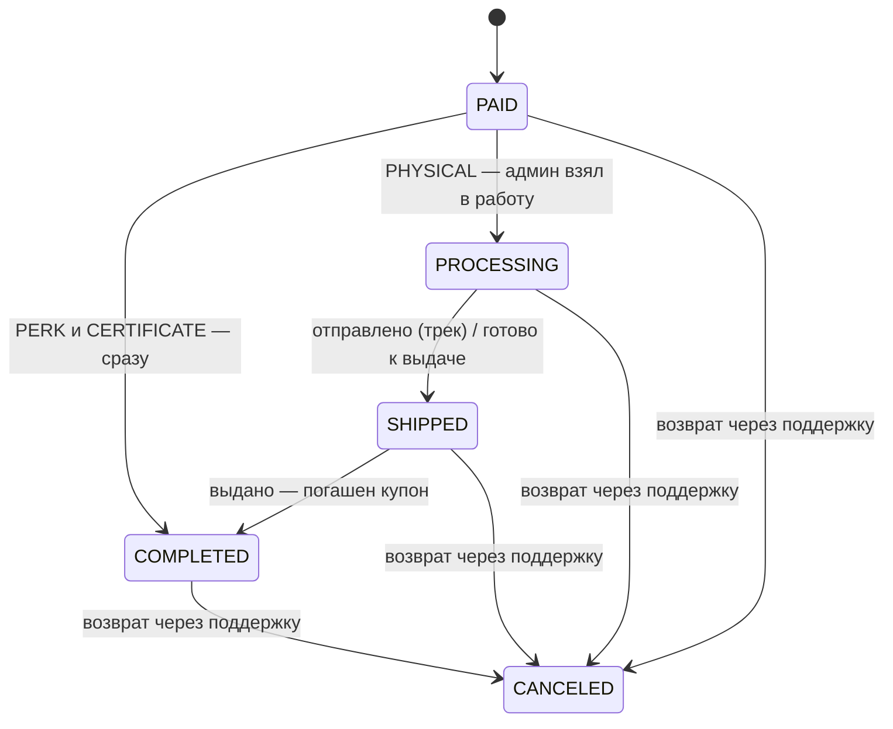

# План реализации: магазин

Статус: **реализовано**, кроме решений владельца продукта (§9), проверки
оферты юристом и выпуска APK. Как сделано по факту и где отступили от плана —
[`shop.md`](./shop.md). Разбивка на задачи — [`tasks_shop.md`](./tasks_shop.md).

Магазин — витрина внутри приложения, где заказчик и исполнитель покупают
товары за деньги со своего внутреннего баланса. Товары двух природ:

- **привилегии** — цифровой товар, который меняет правила платформы для
  покупателя. В первой версии это три товара про комиссию исполнителя:
  «Комиссия вдвое меньше», «Комиссия минус 5 пунктов» и «День без комиссии»;
- **вещи и коды** — мерч (футболка, термокружка) и сертификаты партнёров.

Каталог, склад, цены и обработка заказов — из админ-панели.

---

## 1. Что уже есть и что берём

Магазин почти целиком собирается из готовых частей. Новое в нём — цена,
витрина и привилегии; выдача вещей и кодов уже решена подарками ачивок.

| Нужно магазину | Что уже есть | Где |
| :--- | :--- | :--- |
| Списать деньги с баланса, не уводя его в минус | `Ledger.Reserve` — дебет с проверкой баланса | `backend/service/ledger.go` |
| Выручка на отдельном счёте и её вывод | счёт `COMMISSION` и `Ledger.Payout` — тот же приём | [`financial_system.md`](./financial_system.md#4b-комиссия-платформы) |
| Склад вещей, пул кодов, купон, погашение при выдаче | `gifts`, `gift_codes`, `user_gifts`, `giftRepo.Issue` / `RedeemCoupon` | [`achievements.md`](./achievements.md#7-подарки), `backend/repository/gift.go` |
| Экран «мои купоны» | `GiftsPage.vue` | `frontend/src/pages/executor/` |
| Ставка комиссии исполнителя в одном месте | `Levels.For` → `Level.Percent`, ставка пишется в заказ | `backend/service/achievement.go` |
| Уведомления в приложении | внутренняя почта `user_mail` | [`achievements.md`](./achievements.md) |
| Права на разделы админки | каталог разделов `permissionCatalog` | [`roles.md`](./roles.md) |
| События для ачивок | outbox `domain_events` | `backend/repository/domain_event.go` |
| Проверка сходимости книг | сверка по системным счетам | `GET /admin/finances/reconciliation` |

Отсюда главное решение: **товар магазина — не новая сущность выдачи, а цена
над тем, что платформа уже умеет выдавать.** Вещь и код выдаются как подарок
(`giftRepo.Issue`), только оплаченный. Новый механизм нужен одному роду товара —
привилегии.

---

## 2. Товары

### 2.1 Роды товара

| Род | Что покупатель получает | Чем выдаётся | Остаток |
| :--- | :--- | :--- | :--- |
| `PERK` | привилегия на срок: сниженная или нулевая комиссия | строка `user_perks` | не ограничен |
| `PHYSICAL` | вещь; купон, который гасит администратор при выдаче или отправке | `giftRepo.Issue` по подарку `PHYSICAL` | склад подарка `gifts.stock` |
| `CERTIFICATE` | код партнёра, показывается по запросу владельца | `giftRepo.Issue` по подарку `CERTIFICATE` | свободные коды `gift_codes` |

`BONUS` и `PROMO` в магазин не попадают: купить деньги за деньги бессмысленно,
а общий промокод на всех не товар.

Товар рода `PHYSICAL` / `CERTIFICATE` ссылается на подарок (`gift_code`).
Склад один на ачивки и магазин: футболка, выданная за «Марафонца», и футболка,
проданная за 1500 ₽, лежат на одной полке, и считать их порознь — значит
рано или поздно продать то, чего нет.

### 2.2 Карточка товара

- название и описание `{ru, en}` — как у узлов каталога и подарков;
- изображения (до 5), порядок;
- цена в копейках (`money.Amount`), необязательная «старая цена» для зачёркивания;
- **кому виден и доступен** — набор ролей (`EXECUTOR`, `CUSTOMER`, …).
  Привилегия на комиссию имеет смысл только исполнителю;
- категория (Привилегии / Мерч / Сертификаты) и порядок сортировки;
- лимит на покупателя: всего и одновременно активных (для `PERK`);
- требуется ли верификация аккаунта;
- для `PHYSICAL` — варианты (размер) и способы получения;
- `is_active` — снять с витрины, не удаляя. Товар с продажами не удаляется:
  на него ссылаются покупки.

---

## 3. Привилегии на комиссию

### 3.1 Три вида

| `perk_kind` | Товар на витрине | `perk_value` | Что делает |
| :--- | :--- | :--- | :--- |
| `COMMISSION_MULTIPLIER` | «Комиссия вдвое меньше» | множитель, `0 < v ≤ 1` | умножает ставку: 7 % → 3.5 % |
| `COMMISSION_DISCOUNT_PP` | «Комиссия минус 5 пунктов» | пункты, `v > 0` | вычитает из ставки: 7 % → 2 % |
| `COMMISSION_FREE` | «День без комиссии», «Неделя без комиссии» | не задаётся | ставка 0 % на весь срок |

Вычитание пунктов — та же арифметика, что у скидки за уровень
(`achievement_level_discount_pp`), поэтому исполнителю не нужно объяснять
новое правило: он уже видит «уровень 3 — минус 3 пункта».

Множитель и вычитание живут вместе, потому что отвечают на разные вопросы.
Множитель держит обещание «вдвое» при любой базовой ставке: поднимут базу с
10 % до 15 % — привилегия даст 7.5 %. Вычитание даёт предсказуемую цифру,
понятную без калькулятора, но при росте базовой ставки дешевеет по смыслу.
Что из этого продавать и почём — решение маркетинга, а не кода.

### 3.2 Срок

| Поле | Пример | Смысл |
| :--- | :--- | :--- |
| `perk_days` | `1`, `7`, `30` | срок действия с момента начала |

**Бессрочной привилегии нет.** Разовые 1000 ₽ за половину комиссии навсегда —
это продажа доли выручки платформы по фиксированной цене: исполнитель с
оборотом 100 000 ₽ в месяц при ставке 10 % окупает её за шесть дней и дальше
платит вдвое меньше годами. Срок — обязательное поле, валидатор не пропускает
пустое.

Беспроцентный период — это тот же `perk_days`: «День без комиссии» —
`perk_days = 1`, «Неделя» — `7`. Отдельной механики он не требует, но цена у
него другой природы: это прямой отказ платформы от выручки за период, а не
скидка с неё. Считать цену нужно от средней комиссии исполнителя за день, а не
от цены соседних товаров (§9).

### 3.3 Формула

```
level_percent = clamp(base − level × discount_pp, 0, base)    # как сейчас
percent =
    COMMISSION_MULTIPLIER   → level_percent × value            # новое
    COMMISSION_DISCOUNT_PP  → clamp(level_percent − value, 0, base)
    COMMISSION_FREE         → 0
```

- Привилегия применяется **после** уровня. Так «вдвое меньше» остаётся вдвое
  меньше той комиссии, которую исполнитель платил бы сейчас, — ровно то, что
  написано на витрине.
- Считается там же, где уровень, — в `Levels.For`. Это единственная точка, где
  определяется ставка исполнителя, и через неё уже ходят
  `OrderService.commissionLevel` (подтверждение заказа) и решение спора
  «неизвестно» (`dispute.go`). Отдельный вызов в каждом месте разошёлся бы при
  первом новом пути денег.
- Зажим `[0, base]` остаётся в Go; значение, не подходящее своему виду
  (множитель вне `(0, 1]`, неположительные пункты), не применяется и пишет
  денежный инцидент.

`Level` получает поля `PerkKind`, `PerkValue` и `PerkID`; в заказ вместе с
`commission_percent` и `commission_level` пишется `commission_perk_id`. Через
месяц по двум одинаковым заказам с разной комиссией ответ на «почему» должен
читаться из самого заказа.

### 3.4 Одна привилегия в один момент, остальные — в очередь

Привилегии **не складываются**: ни две одинаковые в ×0.25, ни разные в
«минус 5 пунктов от половины». Иначе витрина превращается в способ обнулить
комиссию за пару тысяч рублей.

Покупки **становятся в очередь** — по всем видам сразу, а не внутри своего:

```
starts_at  = max(now(), последний expires_at непросроченных привилегий
                        на комиссию этого пользователя)
expires_at = starts_at + perk_days
```

Очередь общая именно потому, что видов стало три. Если бы каждый вид шёл
своим чередом, беспроцентная неделя тикала бы поверх купленного множителя и
съедала бы его оплаченные дни. В очереди не сгорает ничего: купленное просто
начинается позже, и витрина честно пишет дату начала — «начнёт действовать
3 октября».

Действует привилегия, у которой `starts_at ≤ now() < expires_at` и
`revoked_at IS NULL`. Если по ошибке админа их окажется несколько сразу,
применяется **самая выгодная покупателю** (дающая наименьшую ставку), а не их
композиция; её id и попадает в заказ.

Лимит «одновременно купленных вперёд» (`max_active_per_user`, по умолчанию 3)
считает всю очередь по всем видам: иначе год вперёд по старой цене набирается
тремя товарами вместо одного.

### 3.5 Где привилегия не действует

- **Вознаграждения из `BONUSES`** (`commissionOnBonus`) берут базовую ставку без
  уровня — и без привилегии тоже, включая беспроцентный период. Это решение уже принято для уровней, и
  привилегия ему следует.
- **Чаевые** комиссией не облагаются вовсе.
- **Заказы, подтверждённые до покупки**, не пересчитываются: ставка
  фиксируется в момент подтверждения.

Привилегия считается по моменту **подтверждения** заказа, а не взятия: заказ,
взятый вчера и подтверждённый сегодня после покупки, закрывается по сниженной
ставке. На витрине это пишется явно.

### 3.6 Честная витрина

- Карточка привилегии показывает текущую ставку покупателя и ставку с ней:
  «Сейчас 7 % → с привилегией 3.5 %», «Сейчас 7 % → 2 %», «Сейчас 7 % → 0 %
  на 7 дней». Считает сервер по формуле §3.3, а не текст на карточке.
- Ниже — окупаемость по его собственной комиссии за последние 30 дней из
  проводок `COMMISSION`: «за прошлый месяц вы заплатили 2 400 ₽ комиссии;
  привилегия сэкономила бы 1 200 ₽».
- И порог окупаемости — сколько нужно заработать за срок, чтобы экономия
  покрыла цену (§9.1): «окупается, если за 30 дней вы выполните заказов на
  20 000 ₽».
- **Если ставка покупателя по уровню уже 0 %** (базовая ставка 0 или уровень
  снял всё), покупка отклоняется с `409` и понятным текстом. Продавать
  половину от нуля — прямой обман; предупреждения тут недостаточно. Проверяется
  ставка **без** привилегий: во время беспроцентной недели ставка тоже 0, но
  купить следующую привилегию в очередь это мешать не должно.
- Если очередь не пуста, на кнопке покупки стоит дата начала, а не «сейчас».
- На дашборде исполнителя и странице ачивок — плашка активной привилегии с
  датой окончания и, если очередь не пуста, строкой «дальше: …»; за 3 дня до
  конца последней в очереди — письмо во внутреннюю почту.

---

## 4. Покупка

### 4.1 Деньги

Новый системный счёт **`SHOP`** — выручка магазина. Три типа проводок:

| Тип | Счёт | Знак | Смысл |
| :--- | :--- | :--- | :--- |
| `SHOP_PURCHASE` | пользователь → `SHOP` | `-1` | оплата покупки |
| `SHOP_REFUND` | `SHOP` → пользователь | `+1` | возврат при отмене |
| `SHOP_PAYOUT` | `SHOP` → `DEPOSITS` | `0` | администратор вывел выручку |

- Оплата — `Ledger.Reserve`: баланс не может уйти в минус.
  `min_balance_limit`, который позволяет исполнителю быть в минусе ради
  штрафов, к магазину не относится — купить в долг нельзя.
- Выводу выручки — `Ledger.Payout` с `DebitAvailable`, как у комиссии: два
  одновременных вывода не заберут больше, чем собрано.
- Возврат — `Ledger.Release` из `SHOP`. Если выручку уже вывели и на счёте
  меньше суммы возврата, `SHOP` уходит в минус: возврат покупателю — обязанность
  платформы, а не функция остатка на счёте. Сверка покажет минус, это и есть
  сигнал.
- Сверка получает `SHOP` в разбивке по счетам.
- Комиссия с продаж магазина не берётся: продаёт сама платформа.

Оплата только с внутреннего баланса. Не хватает — кнопка «Пополнить» ведёт на
обычную заявку `TOPUP`. Эквайринг — отдельная задача вне этого плана.

### 4.2 Одна транзакция

```
BEGIN
  SELECT … FROM shop_products WHERE id = $1 FOR UPDATE      -- цена, лимиты, активность
  проверки: роль, верификация, статус пользователя, лимит на покупателя,
            цена совпала с expected_price, для PERK — ставка по уровню > 0
            и очередь короче max_active_per_user
  INSERT shop_orders (… request_id …)                       -- уникальность = идемпотентность
  Ledger.Reserve(user → SHOP, SHOP_PURCHASE, price × qty)
  выдача:
    PERK        → INSERT user_perks (starts_at, expires_at по §3.4)
    PHYSICAL    → giftRepo.Issue (снимает stock) → user_gifts
    CERTIFICATE → giftRepo.Issue (захватывает код)  → user_gifts
  INSERT domain_events ('shop.purchased')
COMMIT
→ после коммита: письмо во внутреннюю почту, счётчик новых заказов админу
```

Правила, которые держит транзакция:

- **Идемпотентность.** Клиент генерирует `request_id` (UUID) при открытии окна
  оформления; `UNIQUE (user_id, request_id)`. Повтор запроса после обрыва сети
  возвращает ту же покупку, а не списывает второй раз.
- **Цена, которую видел покупатель.** Запрос несёт `expected_price`. Админ
  поменял цену между показом и нажатием — `409 price_changed`, клиент
  перерисовывает карточку. В покупку пишется снимок цены и названия.
- **Нет товара — нет денег.** В отличие от ачивок, где пустой склад — мягкий
  отказ (ачивка выдаётся без подарка), здесь `ErrGiftUnavailable` откатывает
  всю транзакцию и возвращает `409 out_of_stock`. Взять деньги и не выдать
  купленное нельзя.
- **Кто не может покупать:** `BANNED`, `SOFT_BANNED` (мягкий бан оставляет
  доступ к балансу, но не к тратам — магазин не попадает в разрешённый список
  `middleware/soft_ban.go`), пользователи без нужной роли; для товаров с
  флагом — неверифицированные.
- **Количество** — для `PHYSICAL` до `max_qty_per_order` (по умолчанию 5), для
  `PERK` и `CERTIFICATE` всегда 1.
- Выключатель `shop_enabled` в системных настройках: `0` прячет витрину и
  отклоняет покупки, админка остаётся доступной.

### 4.3 Статусы покупки



| Случай | Деньги | Выдача |
| :--- | :--- | :--- |
| `PHYSICAL` до получения | полный возврат | купон `CANCELED`, склад — по галочке «вернуть на склад» |
| `PHYSICAL` после получения, 7 дней | полный возврат после приёма вещи | купон остаётся `REDEEMED`, склад — по галочке |
| `PERK`, срок не начался | полный возврат | `user_perks.revoked_at` |
| `PERK`, срок идёт | пропорционально неиспользованным дням — сервер предлагает сумму, админ может изменить | `user_perks.revoked_at`; следующие в очереди не сдвигаются |
| `CERTIFICATE` до показа кода | полный возврат | код возвращается в пул |
| `CERTIFICATE` после показа кода | только если партнёр подтвердил, что код не использован | код в пул не возвращается |

Отменяет всегда администратор, причина обязательна, пишется `[AUDIT]` с его
id, как вывод комиссии. Возврат и снятие выдачи — в одной транзакции.

### 4.4 Возврат — только через чат поддержки

Самостоятельной отмены у покупателя нет — ни кнопки, ни эндпоинта. Возврат,
отказ и претензия оформляются **диалогом в чате поддержки**; это закреплено в
оферте (п. 8, [`shop_offer.md`](./shop_offer.md)).

- В «Моих покупках» у каждой покупки кнопка **«Оформить возврат»**. Она
  открывает существующий чат поддержки (`/support/chat`) и подставляет в поле
  ввода «Возврат по покупке №1042: » — отправляет сообщение сам покупатель,
  дописав причину.
- Сообщение с номером покупки в чате поддержки подсвечивается ссылкой на
  карточку покупки в админке; из карточки — обратно в чат этого пользователя.
- Решение принимает оператор в карточке покупки («Отменить с возвратом», §4.3)
  и сообщает его в том же чате. Срок ответа по оферте — 10 дней; покупки, по
  которым есть непрочитанное обращение старше 5 дней, выделяются в списке.
- Номер покупки в сообщении ищется регуляркой по шаблону «№\d+» только для
  подсветки: на деньги он не влияет, отмену всегда делает человек.

### 4.5 Оферта

Текст — [`shop_offer.md`](./shop_offer.md), черновик до проверки юристом.

- Страница оферты в приложении `/shop/offer`; ссылка — в подвале витрины и в
  окне оформления.
- В окне оформления — обязательная отметка «Я прочитал(а) оферту и принимаю
  её условия»; без неё кнопка «Оплатить» неактивна.
- Запрос покупки несёт `offer_version`. Сервер сверяет его с текущей
  редакцией (`shop_offer_version` в системных настройках) и при расхождении
  отвечает `409 offer_changed` — клиент показывает новую редакцию. Принятая
  редакция пишется в `shop_orders.offer_version`: спор по покупке разбирается
  по той редакции, которую человек принял.

---

## 5. Получение вещей

Способы получения задаются на товаре, админ включает нужные:

| Способ | Что спрашиваем при оформлении | Что делает админ |
| :--- | :--- | :--- |
| `PICKUP` | пункт выдачи из справочника | по купону на месте гасит его → `COMPLETED` |
| `DELIVERY` | адрес (подсказки DaData, как у заказов), получатель, телефон | вносит трек-номер → `SHIPPED`, затем `COMPLETED` |

Адрес и размер ложатся в `user_gifts.fulfillment` — поле для этого там уже
есть. Стоимость доставки в первой версии включается в цену товара; отдельная
строка доставки — открытый вопрос (§9).

Справочник пунктов выдачи — таблица `shop_pickup_points` (название, адрес,
часы работы, `is_active`).

---

## 6. Схема данных

Миграций две: добавление значений enum не работает внутри транзакции
(см. `038_order_commission.sql`), а таблицы лучше создавать в ней.

**`058_shop_money.sql`** (`-- +migrate no-transaction`):

```sql
ALTER TYPE transaction_type ADD VALUE IF NOT EXISTS 'SHOP_PURCHASE';
ALTER TYPE transaction_type ADD VALUE IF NOT EXISTS 'SHOP_REFUND';
ALTER TYPE transaction_type ADD VALUE IF NOT EXISTS 'SHOP_PAYOUT';

INSERT INTO system_accounts (code, name) VALUES ('SHOP', 'Выручка магазина')
ON CONFLICT (code) DO NOTHING;
```

**`059_shop.sql`**:

```sql
CREATE TABLE shop_products (
    id                  UUID PRIMARY KEY DEFAULT gen_random_uuid(),
    kind                VARCHAR(16) NOT NULL CHECK (kind IN ('PERK', 'PHYSICAL', 'CERTIFICATE')),
    category            VARCHAR(32) NOT NULL,
    title               JSONB NOT NULL,
    description         JSONB NOT NULL DEFAULT '{}'::jsonb,
    images              JSONB NOT NULL DEFAULT '[]'::jsonb,        -- ["/uploads/shop/…"]
    price               BIGINT NOT NULL CHECK (price > 0),          -- копейки
    compare_at_price    BIGINT NULL,
    roles               TEXT[] NOT NULL DEFAULT '{}',               -- пусто = все
    requires_verified   BOOLEAN NOT NULL DEFAULT FALSE,
    per_user_limit      INT NULL,                                   -- NULL = без лимита
    max_qty_per_order   INT NOT NULL DEFAULT 1,
    -- PHYSICAL / CERTIFICATE
    gift_code           VARCHAR(64) NULL REFERENCES gifts(code),
    variants            JSONB NOT NULL DEFAULT '[]'::jsonb,         -- [{"code":"M","title":{…}}]
    fulfillment_methods TEXT[] NOT NULL DEFAULT '{}',               -- PICKUP, DELIVERY
    -- PERK
    perk_kind           VARCHAR(32) NULL CHECK (perk_kind IN
                            ('COMMISSION_MULTIPLIER', 'COMMISSION_DISCOUNT_PP', 'COMMISSION_FREE')),
    -- Смысл значения задаёт вид: множитель (0;1], пункты процента (>0),
    -- у беспроцентного периода значения нет вовсе.
    perk_value          NUMERIC(6,4) NULL,
    perk_days           INT NULL CHECK (perk_days > 0),
    max_active_per_user INT NULL,
    sort_order          INT NOT NULL DEFAULT 0,
    is_active           BOOLEAN NOT NULL DEFAULT FALSE,
    created_at          TIMESTAMPTZ NOT NULL DEFAULT now(),
    updated_at          TIMESTAMPTZ NOT NULL DEFAULT now(),
    CHECK (kind <> 'PERK' OR (perk_kind IS NOT NULL AND perk_days IS NOT NULL)),
    -- Значение обязано подходить своему виду: база не пропускает товар,
    -- который в Go пришлось бы отбрасывать инцидентом.
    CHECK (perk_kind IS NULL
           OR (perk_kind = 'COMMISSION_MULTIPLIER' AND perk_value > 0 AND perk_value <= 1)
           OR (perk_kind = 'COMMISSION_DISCOUNT_PP' AND perk_value > 0)
           OR (perk_kind = 'COMMISSION_FREE' AND perk_value IS NULL)),
    CHECK (kind = 'PERK' OR gift_code IS NOT NULL)
);

CREATE TABLE shop_orders (
    id              UUID PRIMARY KEY DEFAULT gen_random_uuid(),
    number          BIGSERIAL UNIQUE,                   -- «Заказ №1042» для людей
    user_id         UUID NOT NULL REFERENCES users(id),
    request_id      UUID NOT NULL,
    product_id      UUID NOT NULL REFERENCES shop_products(id),
    product_snapshot JSONB NOT NULL,                    -- название, род, параметры привилегии
    variant         VARCHAR(32) NULL,
    quantity        INT NOT NULL CHECK (quantity > 0),
    unit_price      BIGINT NOT NULL,
    total           BIGINT NOT NULL,
    status          VARCHAR(16) NOT NULL
                    CHECK (status IN ('PAID', 'PROCESSING', 'SHIPPED', 'COMPLETED', 'CANCELED')),
    fulfillment     JSONB NOT NULL DEFAULT '{}'::jsonb, -- способ, пункт/адрес, трек
    refunded_amount BIGINT NOT NULL DEFAULT 0,
    offer_version   INT NOT NULL,                       -- принятая редакция оферты (§4.5)
    cancel_reason   TEXT NULL,
    canceled_by     UUID NULL REFERENCES users(id),
    created_at      TIMESTAMPTZ NOT NULL DEFAULT now(),
    updated_at      TIMESTAMPTZ NOT NULL DEFAULT now(),
    UNIQUE (user_id, request_id)
);
CREATE INDEX idx_shop_orders_user ON shop_orders (user_id, created_at DESC);
CREATE INDEX idx_shop_orders_status ON shop_orders (status, created_at);

-- Купоны покупки: одна строка user_gifts на единицу товара.
ALTER TABLE user_gifts ADD COLUMN IF NOT EXISTS shop_order_id UUID NULL REFERENCES shop_orders(id);

-- Проводки магазина ссылаются на покупку: transactions.order_id занят
-- заказами, поэтому у журнала своя колонка — иначе по покупке не найти ни её
-- оплату, ни её возвраты (карточка покупки, §8; контроль возвратов, §4.3).
ALTER TABLE transactions ADD COLUMN IF NOT EXISTS shop_order_id UUID NULL REFERENCES shop_orders(id);

CREATE TABLE user_perks (
    id            UUID PRIMARY KEY DEFAULT gen_random_uuid(),
    user_id       UUID NOT NULL REFERENCES users(id) ON DELETE CASCADE,
    kind          VARCHAR(32) NOT NULL,
    value         NUMERIC(6,4) NULL,                     -- NULL у COMMISSION_FREE
    starts_at     TIMESTAMPTZ NOT NULL,
    expires_at    TIMESTAMPTZ NOT NULL,
    shop_order_id UUID NULL REFERENCES shop_orders(id),  -- NULL — выдана админом
    revoked_at    TIMESTAMPTZ NULL,
    revoked_by    UUID NULL REFERENCES users(id),
    created_at    TIMESTAMPTZ NOT NULL DEFAULT now(),
    CHECK (expires_at > starts_at)
);
CREATE INDEX idx_user_perks_active ON user_perks (user_id, kind, expires_at) WHERE revoked_at IS NULL;

CREATE TABLE shop_pickup_points (
    id        UUID PRIMARY KEY DEFAULT gen_random_uuid(),
    title     JSONB NOT NULL,
    address   TEXT NOT NULL,
    hours     TEXT NULL,
    is_active BOOLEAN NOT NULL DEFAULT TRUE
);

ALTER TABLE orders ADD COLUMN IF NOT EXISTS commission_perk_id UUID NULL REFERENCES user_perks(id);

INSERT INTO system_settings (key, value) VALUES ('shop_enabled', '0'), ('shop_offer_version', '1')
ON CONFLICT (key) DO NOTHING;
```

Всё создаётся выключенным: `shop_enabled = 0`, товары `is_active = FALSE`.
Открыть магазин и назначить цену — решение администратора, а не миграции.

Запрос привилегии на пути подтверждения заказа — один, по частичному индексу:

```sql
SELECT id, kind, value FROM user_perks
 WHERE user_id = $1 AND kind IN ('COMMISSION_MULTIPLIER', 'COMMISSION_DISCOUNT_PP', 'COMMISSION_FREE')
   AND revoked_at IS NULL AND starts_at <= now() AND expires_at > now();
```

Строк обычно ноль или одна: очередь (§3.4) не даёт им наложиться. Сравнивать
виды в SQL нечем — «минус 5 пунктов» и «×0.5» дают разную ставку при разном
уровне, — поэтому самую выгодную выбирает Go по той же формуле §3.3.

---

## 7. API

### Покупатель (`RequireAuth`, любая роль)

| Метод | Путь | Что делает |
| :--- | :--- | :--- |
| `GET` | `/api/shop/products` | витрина: активные товары, доступные ролям пользователя; `?category=` |
| `GET` | `/api/shop/products/{id}` | карточка; для `PERK` — текущая ставка, ставка с привилегией, окупаемость (§3.5) |
| `POST` | `/api/shop/orders` | покупка: `{product_id, request_id, expected_price, offer_version, quantity, variant, fulfillment}` |
| `GET` | `/api/shop/orders` | мои покупки |
| `GET` | `/api/shop/orders/{id}` | покупка, купоны, статус доставки |
| `GET` | `/api/shop/pickup-points` | пункты выдачи |
| `GET` | `/api/me/perks` | активная привилегия и очередь за ней |

Ошибки покупки: `422 insufficient_funds` (как у удержания по заказу), `409 price_changed`,
`409 out_of_stock`, `409 limit_reached`, `409 offer_changed`, `409 perk_useless` (ставка по уровню уже 0),
`403 verification_required`, `404` для товара, скрытого от роли.

### Админка

| Метод | Путь | Право |
| :--- | :--- | :--- |
| `GET/POST` | `/api/admin/shop/products` | `shop.view` / `shop.create` |
| `PUT` | `/api/admin/shop/products/{id}` | `shop.edit` |
| `POST` | `/api/admin/shop/images` | `shop.edit` — загрузка изображения в `/uploads/shop/` |
| `GET/POST/PUT` | `/api/admin/shop/pickup-points` | `shop.view` / `shop.edit` |
| `GET` | `/api/admin/shop/orders` | `shop_orders.view` — фильтры: статус, товар, период, поиск по номеру и телефону |
| `POST` | `/api/admin/shop/orders/{id}/status` | `shop_orders.edit` — `PROCESSING`/`SHIPPED`/`COMPLETED`, трек |
| `POST` | `/api/admin/shop/orders/{id}/cancel` | `shop_orders.edit` — причина, сумма возврата, вернуть на склад |
| `POST` | `/api/admin/users/{id}/perks` | `shop_orders.edit` — выдать привилегию вручную (вид, значение, дни): компенсация, акция |
| `DELETE` | `/api/admin/perks/{id}` | `shop_orders.edit` — отозвать без возврата |
| `GET` | `/api/admin/finances/shop` | `shop_revenue.view` — остаток `SHOP`, продажи за период |
| `POST` | `/api/admin/finances/shop/payout` | `shop_revenue.edit` — вывод выручки |

Три раздела прав, а не один: заводить товары (маркетинг), обрабатывать заказы
(склад) и выводить деньги (финансы) — разные люди.

Погашение купона на пункте выдачи — существующий
`POST /api/admin/gifts/coupons/{coupon}/redeem`. Для купона с
`shop_order_id` он же переводит покупку в `COMPLETED`, когда погашены все её
купоны.

---

## 8. Интерфейс

### Покупатель

- Пункт **«Магазин»** в меню заказчика и исполнителя; одна страница в
  `pages/shared/ShopPage.vue` — витрина фильтруется сервером по ролям.
- Витрина: вкладки категорий, карточки с изображением, ценой, «нет в наличии».
- Карточка товара: галерея, описание, варианты, способ получения; для
  привилегии — блок «Сейчас / С привилегией / Окупаемость» (§3.6) и дата
  начала, если очередь не пуста.
- Окно оформления: итог, баланс до и после, способ получения, адрес с
  подсказками DaData. Кнопка «Оплатить N ₽» блокируется на время запроса;
  `request_id` создаётся при открытии окна и переживает повторное нажатие.
  Обязательная отметка о согласии с офертой и ссылка на неё (§4.5).
- Страница оферты `/shop/offer`.
- **«Мои покупки»** — список с номером, статусом, купонами и треком; у каждой
  покупки кнопка «Оформить возврат», ведущая в чат поддержки (§4.4). Купоны
  магазина показываются и на `GiftsPage.vue` рядом с подарками ачивок, с
  пометкой «куплено».
- Плашка активной привилегии на дашборде исполнителя и на странице ачивок, где
  уже показана ставка по уровню: «7 % × 0.5 = 3.5 % до 17 октября», «0 % до
  20 сентября». Ниже — очередь, если в ней что-то есть.
- Загрузка данных — по правилам [`frontend_data_loading.md`](./frontend_data_loading.md):
  витрина из кэша, скелетоны, фоновая догрузка. Остаток и цена перед оплатой
  всё равно проверяются сервером.

### Админка

- **«Магазин → Товары»** (`admin/ShopProducts.vue`): таблица, форма товара с
  полями по роду и по виду привилегии (у `COMMISSION_FREE` поля значения нет),
  загрузка изображений, привязка к подарку (с показом текущего
  склада / свободных кодов), переключатель активности, предпросмотр карточки.
- **«Магазин → Заказы»** (`admin/ShopOrders.vue`): фильтр по статусу (в адресе,
  как у заказов), карточка покупки со снимком товара, адресом, купонами,
  проводками; кнопки смены статуса и отмены с возвратом, ссылка на чат
  поддержки покупателя. Бейдж с числом `PAID` на пункте меню, выделение
  покупок с обращением о возврате старше 5 дней.
- В чате поддержки (`AdminSupportChats.vue`) «№1042» в сообщении — ссылка на
  карточку покупки.
- **«Магазин → Пункты выдачи»** — справочник.
- **«Выручка магазина»** (`admin/ShopRevenue.vue`) — по образцу
  `PlatformCommission.vue`: остаток, продажи за период по товарам, вывод.
- В истории пользователя (`UserHistoryModal.vue`) — вкладка «Покупки» и
  активные привилегии.
- Системные настройки: `shop_enabled`.

---

## 9. Открытые вопросы (решает владелец продукта)

1. ✅ **Срок «Комиссии вдвое меньше» — 30 дней, цена 1000 ₽.** Решено
   владельцем продукта. Порог окупаемости для покупателя:

   ```
   экономия за срок = оборот × ставка × (1 − множитель)
   окупается, когда оборот ≥ цена / (ставка × (1 − множитель))
   ```

   Привилегия экономит **половину комиссии**, а не половину заказа: при ставке
   10 % с заказа за 100 ₽ комиссия 10 ₽, привилегия возвращает 5 ₽. Чтобы 5 ₽
   с заказа покрыли 1000 ₽, нужно 200 таких заказов — 20 000 ₽ оборота за 30
   дней. При 10 000 ₽ оборота исполнитель сэкономит 500 ₽ и потеряет 500 ₽.

   | Ставка по уровню | Порог оборота за 30 дней |
   | :--- | :--- |
   | 20 % | 10 000 ₽ |
   | 10 % | 20 000 ₽ |
   | 7 % | ≈ 28 600 ₽ |
   | 5 % | 40 000 ₽ |

   Уровень снижает ставку и тем поднимает порог — поэтому витрина считает его
   по ставке конкретного покупателя (§3.6). Цены вычитания пунктов и
   беспроцентного периода — открыты.
1a. **Цена беспроцентного периода.** Здесь платформа отказывается от всей
   выручки за период, поэтому цена считается от средней дневной комиссии
   исполнителя, а не «на глаз» рядом с другими товарами. Открытый вопрос —
   одна цена для всех или своя по уровню исполнителя; вторая честнее, но
   первая понятнее, и в первой версии цена одна.
2. **Юридическая сторона.** Черновик оферты — [`shop_offer.md`](./shop_offer.md):
   ответственность за выбор на покупателе, возврат только диалогом в чате
   поддержки. До публикации — проверка юристом, реквизиты и решение о
   фискальных чеках: внутренний баланс от них не освобождает.
3. **Доставка** — включена в цену или отдельной строкой, какие службы.
4. **Остаток по размерам.** В первой версии склад общий на товар, размер —
   пожелание в `fulfillment`. Если размеры кончаются по-разному, каждый размер
   заводится отдельным подарком; полноценные варианты со своим складом — вторая
   версия.
5. ✅ **Возврат привилегии** — пропорционально неиспользованным дням, не начавшаяся —
   полностью (оферта, п. 8.6). «Не возвращается совсем» не выбрано: отказ от
   услуги с оплатой фактически оказанного — право потребителя, и условие о
   полном невозврате суд бы не применил.
6. **Покупка баллами ачивок** вместо рублей — отдельная механика, в этот план
   не входит: баллы определяют уровень, и трата баллов снижала бы уровень.

---

## 10. Что вне первой версии

- Корзина из нескольких товаров. Одна покупка — один товар: так проще
  отмены, возвраты и склад, а мерч покупают редко.
- Промокоды и скидки на товары магазина.
- Оплата картой мимо внутреннего баланса.
- Виды привилегий, не связанные с комиссией (приоритет в выдаче заказов,
  увеличенный радиус). Схема к ним готова — `perk_kind` расширяется, каждый
  вид получает свою точку применения в Go. В очередь §3.4 они не встают:
  она общая только для видов, которые меняют одно и то же — ставку комиссии.
