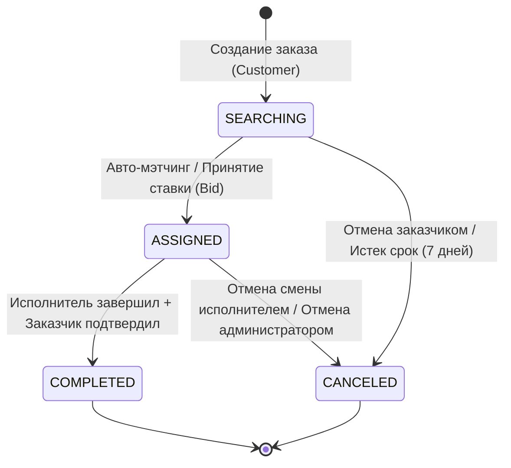

# Жизненный цикл заказов (Order Lifecycle & Workflow)

Документ подробно описывает состояния заказов, правила переходов между статусами и механику работы с ними.

---

## 1. Диаграмма состояний заказа

---

## 2. Статусы заказов

| Статус | Описание |
| :--- | :--- |
| `SEARCHING` | Заказ создан и ожидает назначения исполнителя или приема ставок (для строительного мусора). |
| `ASSIGNED` | Заказ привязан к конкретному исполнителю (`executor_id`). Открыта комната чата. |
| `COMPLETED` | Заказ успешно выполнен, средства переведены исполнителю. Чат заблокирован. |
| `CANCELED` | Заказ отменен, заблокированная сумма возвращена заказчику. Чат заблокирован. |

---

## 3. SLA и автоматический даунгрейд тарифа

Для срочных заказов (`URGENT` и `ASAP`) действует контроль времени:
- Если исполнитель не прибывает на место в отведённый срок, фоновый воркер производит **SLA-даунгрейд тарифа** (снижение коэффициента до `STANDARD`).
- Корректируется итоговая стоимость заказа и сумма холда.
- Участникам чата отправляется системное уведомление `{"type":"system","action":"downgrade"}`.
