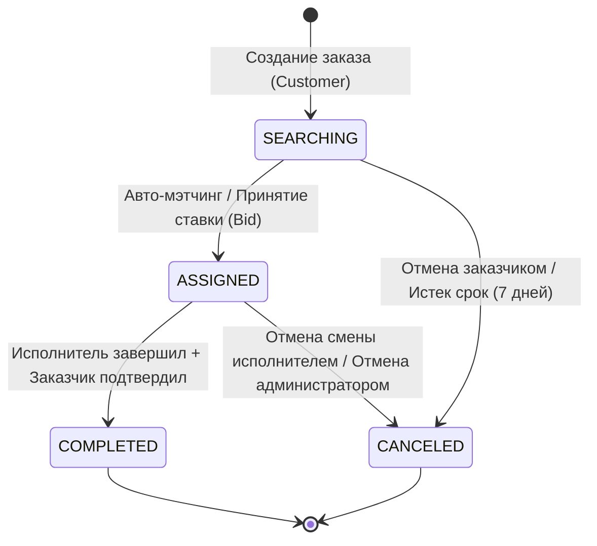

# Жизненный цикл заказов (Order Lifecycle & Workflow)

Документ подробно описывает состояния заказов, правила переходов между статусами и механику работы с ними.

---

## 1. Диаграмма состояний заказа

---

## 2. Статусы заказов

| Статус | Описание |
| :--- | :--- |
| `SEARCHING` | Заказ создан и ожидает назначения исполнителя или приема ставок (для строительного мусора). |
| `ASSIGNED` | Заказ привязан к конкретному исполнителю (`executor_id`). Открыта комната чата. |
| `COMPLETED` | Заказ успешно выполнен, средства переведены исполнителю. Чат заблокирован. |
| `CANCELED` | Заказ отменен, заблокированная сумма возвращена заказчику. Чат заблокирован. |

---

## 3. Автооткрытие смены при взятии заказа

Взять заказ можно только на активной смене — по ней исполнителя находит
автоподбор и по ней же считается штраф за досрочный уход. Раньше исполнитель без
смены получал отказ `executor has no active shift` и должен был вернуться к
панели смены, открыть её и нажать «взять заказ» ещё раз; за это время заказ
нередко уходил другому.

Теперь нажатие «взять заказ» само означает готовность работать: смены нет —
её открывают за исполнителя.

Порядок в `OrderService.Accept` намеренно такой:

1. Проверяется активная смена. Она есть и не `PENALIZED` — дальше всё как прежде.
2. Смены нет — запоминается, что её придётся открыть. Если автооткрытие
   выключено настройкой, метод сразу отвечает прежним отказом.
3. **Сначала проходят все проверки заказа**: чужой ли это заказ, допуск по
   услуге, баланс, лимиты активных и неподтверждённых заказов. Отказ на этом
   шаге не оставляет за исполнителем открытой смены — иначе за досрочный выход
   из неё он заплатил бы штраф ни за что.
4. Смена открывается — назначенный заказ обязан принадлежать исполнителю на
   смене.
5. Назначение выполняется в транзакции. Если оно **не удалось** (типично: заказ
   успел взять другой исполнитель), только что открытая смена закрывается
   обратно как отработавшая — без штрафа. Исполнитель не остаётся со сменой,
   которую не открывал.

Смена, открытая автоматически, ничем не отличается от открытой вручную: то же
плановое окончание, то же автозакрытие по таймеру, тот же штраф за досрочный
выход. Поэтому по умолчанию берётся самая короткая из разрешённых длительностей
(1 час) — чем короче смена, открытая не самим исполнителем, тем меньше он
рискует.

Настройки в `system_settings` (экран администратора → «Технические параметры»):

| Ключ | Значения | По умолчанию | Смысл |
| :--- | :--- | :--- | :--- |
| `auto_shift_on_accept_enabled` | `1` / `0` | `1` | Открывать ли смену за исполнителя. `0` возвращает прежний отказ. |
| `auto_shift_duration_hours` | `1`, `3`, `5` | `1` | Длительность такой смены. Список тот же, что у ручного старта: автоматика не может открыть смену, которую исполнителю выбрать не дают. |

Миграция: `046_auto_shift_on_accept.sql`.

Ставки по строительным заказам (`BidService.CreateBid`) по-прежнему требуют уже
открытой смены: ставка — это заявка на будущую работу, а не взятие заказа, и
между ней и назначением проходит время, в течение которого автоматически
открытая смена успела бы истечь.

Интерфейс исполнителя после успешного взятия перезапрашивает состояние смены
(и со списка, и с карты) и, когда смена появилась, сообщает об этом отдельным
текстом: «Заказ принят в работу. Смена открыта автоматически.»

---

## 4. Автоматическое закрытие заказа поведением услуги

Услуга со скриптовым поведением может закрываться сама, без подтверждения
заказчика. Так работает верификация аккаунта: как только пользователь становится
верифицированным, открытый заказ на верификацию закрывается, а исполнителю
выплачивается вознаграждение.

Механика: изменение состояния публикует доменное событие в очередь
`domain_events` **в той же транзакции** (`order.executed`, `user.verified` и
другие), фоновый воркер `behavior_dispatch` отдаёт событие скрипту услуги, а тот
возвращает эффекты — `complete_order`, `pay_bonus`, `verify_user`,
`system_message`. Закрытие идёт через тот же `confirmTx`, что и подтверждение
заказчиком, поэтому выплаты и эскроу считаются одинаково независимо от того, кто
закрыл заказ.

Подробно: [`service_behaviors.md`](./service_behaviors.md).

---

## 5. SLA и автоматический даунгрейд тарифа

Для срочных заказов (`URGENT` и `ASAP`) действует контроль времени:
- Если исполнитель не прибывает на место в отведённый срок, фоновый воркер производит **SLA-даунгрейд тарифа** (снижение коэффициента до `STANDARD`).
- Корректируется итоговая стоимость заказа и сумма холда.
- Участникам чата отправляется системное уведомление `{"type":"system","action":"downgrade"}`.
