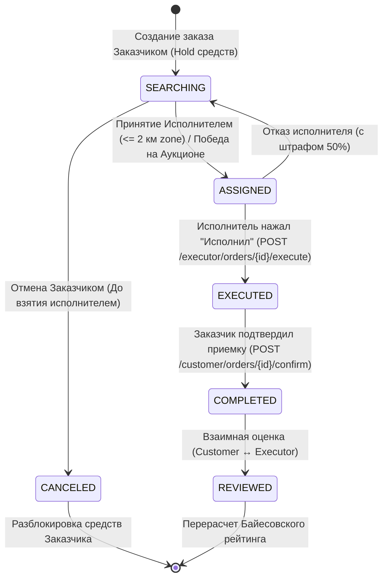
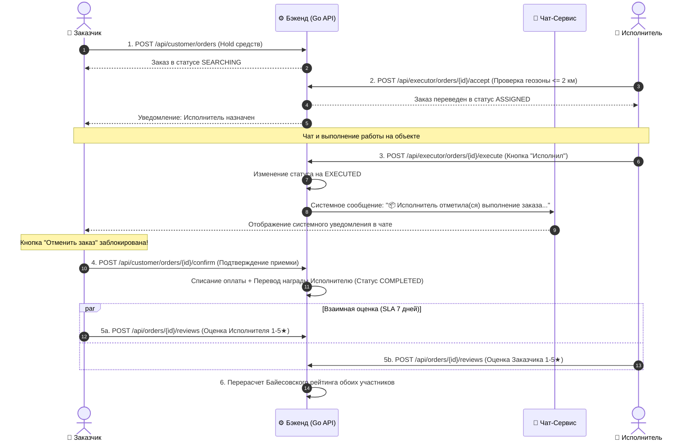

# Двухсторонняя система рейтингов, отзывов и жизненный цикл заказа (Rating System & Order Lifecycle)

Документ подробно описывает бизнес-логику, архитектуру, жизненный цикл заказов, математические модели и техническую реализацию двухсторонней системы рейтингов (`Customer ↔ Executor`).

---

## 1. Двухсторонняя система рейтингов и отзывов (Rating & Review System)

### 1.1. Бизнес-логика и правила
- **Двухсторонняя оценка**:
  - **Заказчик оценивает Исполнителя**: влияет на алгоритм авто-мэтчинга и выбор исполнителя на аукционах.
  - **Исполнитель оценивает Заказчика**: влияет на прозрачность и репутацию заказчика при откликах.
- **Триггер**: Оценку можно выставить **строго после перевода заказа в статус `COMPLETED`**.
- **Временное окно (SLA)**: 7 дней (168 часов) с момента закрытия заказа.
- **Слепой режим (Blind Review)**: Отзыв одной стороны скрыт от другой, пока обе стороны не оставят отзывы либо не истечет 7 дней (защита от «мести»).
- **Чаевые**: в том же окне оценки заказчик может оставить исполнителю чаевые — быстрые кнопки 5 % и 10 % от суммы заказа или произвольная сумма. Отзыв и чаевые отправляются одной кнопкой; чаевые списываются с баланса заказчика (эндпоинт `POST /api/customer/orders/{id}/tip`, не более одного раза на заказ). Денежная механика — в [financial_system.md](financial_system.md), раздел «Чаевые исполнителю».

### 1.2. Математическая модель (Байесовское среднее)
Для избежания искажений рейтинга у новых пользователей применяется формула Байесовского среднего:

$$R = \frac{C \cdot m + \sum r_i}{C + n}$$

Где:
- $n$ — количество полученных оценок.
- $\sum r_i$ — сумма всех звезд.
- $m = 4.8$ — базовая априорная оценка платформы.
- $C = 5$ — вес априорных оценок.

### 1.3. Схема базы данных
```sql
CREATE TABLE IF NOT EXISTS order_reviews (
    id UUID PRIMARY KEY DEFAULT gen_random_uuid(),
    order_id UUID NOT NULL REFERENCES orders(id) ON DELETE CASCADE,
    author_id UUID NOT NULL REFERENCES users(id),
    target_id UUID NOT NULL REFERENCES users(id),
    author_role VARCHAR(20) NOT NULL CHECK (author_role IN ('CUSTOMER', 'EXECUTOR')),
    rating INT NOT NULL CHECK (rating >= 1 AND rating <= 5),
    tags JSONB DEFAULT '[]'::jsonb,
    comment TEXT,
    photos JSONB DEFAULT '[]'::jsonb,
    created_at TIMESTAMP WITH TIME ZONE NOT NULL DEFAULT now(),
    updated_at TIMESTAMP WITH TIME ZONE NOT NULL DEFAULT now(),
    CONSTRAINT unique_order_author UNIQUE (order_id, author_id)
);

ALTER TABLE customer_profiles ADD COLUMN rating NUMERIC(3,2) NOT NULL DEFAULT 5.00, ADD COLUMN reviews_count INT NOT NULL DEFAULT 0;
ALTER TABLE executor_profiles ADD COLUMN rating NUMERIC(3,2) NOT NULL DEFAULT 5.00, ADD COLUMN reviews_count INT NOT NULL DEFAULT 0;
```

---

## 2. Полный жизненный цикл заказа (Order Lifecycle & State Transitions)

### 2.1. Схема состояний заказа (State Machine Diagram)



> **Критическое правило блокировки отмены**:
> - В статусе `SEARCHING`: Заказчик **может** отменить заказ с полным возвратом удержанных средств.
> - В статусах `ASSIGNED` и `EXECUTED`: Заказчик **НЕ может** отменить заказ (запрос отклоняется с HTTP 422). Заказ заблокирован до подтверждения выполнения.

---

### 2.2. Диаграмма взаимодействия сторон (Sequence Diagram)



---

## 3. Таблица эндпоинтов API Заказов и Рейтингов

| Метод | Эндпоинт | Описание | Доступ |
| :--- | :--- | :--- | :--- |
| `POST` | `/api/customer/orders` | Создание заказа и блокировка средств (`SEARCHING`) | `CUSTOMER` |
| `POST` | `/api/customer/orders/{id}/cancel` | Отмена заказа (Разрешено только в `SEARCHING`) | `CUSTOMER` |
| `POST` | `/api/executor/orders/{id}/accept` | Взятие заказа в работу (`ASSIGNED`, зона $\le 2$ км) | `EXECUTOR` |
| `POST` | `/api/executor/orders/{id}/execute` | Фиксация выполнения работы (`EXECUTED` + уведомление в чат) | `EXECUTOR` |
| `POST` | `/api/customer/orders/{id}/confirm` | Приемка работы, списание и перевод средств (`COMPLETED`) | `CUSTOMER` |
| `POST` | `/api/customer/orders/{id}/tip` | Чаевые исполнителю по завершённому заказу (`{ "amount": <рубли> }`, один раз) | `CUSTOMER` |
| `POST` | `/api/orders/{id}/reviews` | Отправить отзыв и оценку (Слепой режим 7 дней) | `CUSTOMER` / `EXECUTOR` |
| `GET` | `/api/users/{id}/reviews` | Публичный список отзывов профиля | Публичный |
| `GET` | `/api/users/{id}/rating?role=...` | Публичный показатель Байесовского рейтинга | Публичный |
