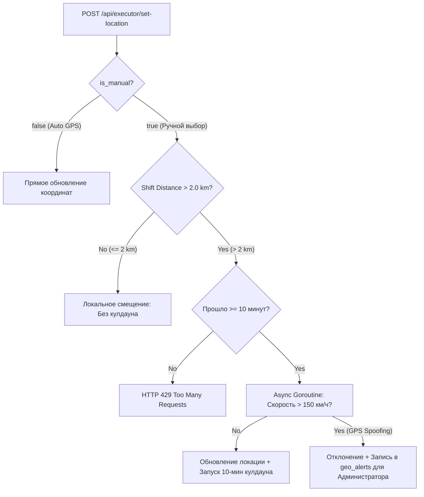

# Система рейтингов, отзывов и карта заказов (Rating System & Executor Interactive Map)

Документ подробно описывает бизнес-логику, архитектуру, математические модели и техническую реализацию двух новых подсистем:
1. **Двухсторонняя система рейтингов и отзывов** (`Customer ↔ Executor`).
2. **Интерактивная карта заказов с гео-зонированием (50 км / 2 км)**, асинхронной валидацией смены локации и аномалий.

---

## 1. Двухсторонняя система рейтингов и отзывов (Rating & Review System)

### 1.1. Бизнес-логика и правила
- **Двухсторонняя оценка**:
  - **Заказчик оценивает Исполнителя**: влияет на алгоритм авто-мэтчинга и выбор исполнителя на аукционах.
  - **Исполнитель оценивает Заказчика**: влияет на прозрачность и репутацию заказчика при откликах.
- **Триггер**: Оценку можно выставить **строго после перевода заказа в статус `COMPLETED`**.
- **Временное окно (SLA)**: 7 дней (168 часов) с момента закрытия заказа.
- **Слепой режим (Blind Review)**: Отзыв одной стороны скрыт от другой, пока обе стороны не оставят отзывы либо не истечет 7 дней (защита от «мести»).

### 1.2. Математическая модель (Байесовское среднее)
Для избежания искажений рейтинга у новых пользователей применяется формула Байесовского среднего:

$$R = \frac{C \cdot m + \sum r_i}{C + n}$$

Где:
- $n$ — количество полученных оценок.
- $\sum r_i$ — сумма всех звезд.
- $m = 4.8$ — базовая априорная оценка платформы.
- $C = 5$ — вес априорных оценок.

### 1.3. Схема базы данных
```sql
CREATE TABLE IF NOT EXISTS order_reviews (
    id UUID PRIMARY KEY DEFAULT gen_random_uuid(),
    order_id UUID NOT NULL REFERENCES orders(id) ON DELETE CASCADE,
    author_id UUID NOT NULL REFERENCES users(id),
    target_id UUID NOT NULL REFERENCES users(id),
    author_role VARCHAR(20) NOT NULL CHECK (author_role IN ('CUSTOMER', 'EXECUTOR')),
    rating INT NOT NULL CHECK (rating >= 1 AND rating <= 5),
    tags JSONB DEFAULT '[]'::jsonb,
    comment TEXT,
    photos JSONB DEFAULT '[]'::jsonb,
    created_at TIMESTAMP WITH TIME ZONE NOT NULL DEFAULT now(),
    updated_at TIMESTAMP WITH TIME ZONE NOT NULL DEFAULT now(),
    CONSTRAINT unique_order_author UNIQUE (order_id, author_id)
);

ALTER TABLE customer_profiles ADD COLUMN rating NUMERIC(3,2) NOT NULL DEFAULT 5.00, ADD COLUMN reviews_count INT NOT NULL DEFAULT 0;
ALTER TABLE executor_profiles ADD COLUMN rating NUMERIC(3,2) NOT NULL DEFAULT 5.00, ADD COLUMN reviews_count INT NOT NULL DEFAULT 0;
```

---

## 2. Интерактивная карта заказов и гео-ограничения (Executor Map & Geofencing)

### 2.1. Зонирование (50 км / 2 км)
1. **Зона обзора (50 км)**:
   - Исполнитель видит все активные заказы (`SEARCHING`) в радиусе **50 км** от своей рабочей геометки.
   - Маркеры заказов группируются в кластеры при отдалении масштаба.
2. **Зона взятия заказа (2 км)**:
   - Взять заказ в работу (`POST /api/orders/{id}/accept`) можно **только если координаты заказа находятся в радиусе $\le 2.0$ км** от утвержденной метки исполнителя.
   - Заказы в диапазоне от 2 до 50 км доступны для просмотра, но кнопка взятия заблокирована.

### 2.2. Правило смены рабочей локации и кулдаун 10 минут


- **Микро-перемещение ($\le 2.0$ км)**: Считается перемещением внутри текущей зоны и **не расходует 10-минутный кулдаун**.
- **Смена района ($> 2.0$ км)**: Активирует 10-минутный кулдаун на следующую ручную смену.
- **Горутина валидации аномалий**: Если физическая скорость перемещения превышает 150 км/ч, транзакция помечается как `GPS_SPOOFING`, отклоняется, а администратору отправляется предупреждение в лог `geo_alerts`.

---

## 3. Таблица эндпоинтов API

| Метод | Эндпоинт | Описание |
| :--- | :--- | :--- |
| `POST` | `/api/orders/{id}/review` | Отправить отзыв и оценку по завершенному заказу |
| `GET` | `/api/users/{id}/reviews` | Получить публичный список отзывов пользователя |
| `GET` | `/api/executor/map-orders` | Получить заказы в радиусе 50 км с флагом `can_accept` ($\le 2$ км) |
| `POST` | `/api/executor/set-location` | Установить геометку с проверкой кулдауна и района |
| `GET` | `/api/admin/geo-alerts` | Список аномалий геолокации для администратора |

---

## 4. Обновление README.md

Раздел документации зарегистрирован в главном индексе `doc/README.md`.
