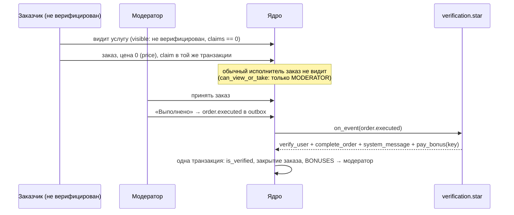

# Особые услуги: поведения-скрипты (Service Behaviors)

Документ описывает механизм, который позволяет добавлять услуги со своими,
непохожими на остальные правилами — не расширяя каждый раз ядро.

---

## 1. Зачем

Раньше каждое необычное свойство услуги становилось колонкой в `service_nodes`
плюс `if` в `service/eligibility.go`: `requires_verification` (миграция 035),
`moderator_only` (040), `min_age`. Это не масштабируется. Услуга «верификация
аккаунта» требует сразу четырёх правил, и ни одно из них не переиспользуемо как
флаг:

* видна только неверифицированному пользователю;
* заказывается один раз;
* бесплатна;
* при выполнении верификатор получает фиксированное вознаграждение от платформы.

Следующая такая услуга потребовала бы ещё четыре колонки. Поэтому правила таких
услуг вынесены из Go-кода в скрипты.

---

## 2. Устройство

```
скрипт (Starlark, backend/behaviors/<код>/*.star)
        │  решает: видно ли, можно ли заказать, сколько стоит,
        │           что сделать в ответ на событие
        ▼
ядро (backend/behavior + service/behavior*.go)
        │  проверяет право просить именно это и применяет
        ▼
обычные сервисы: Ledger, OrderService, users.is_verified, чат
```

Скрипт — **чистая функция от переданных ему фактов**. Он не ходит в базу, не
открывает сокеты, не хранит состояние между вызовами и сам не двигает деньги. Он
отвечает на вопросы и возвращает список **эффектов**, которые хочет применить.
Применяет их ядро — транзакционно, через тот же `Ledger`, через который проходят
все остальные деньги.

Граница именно здесь и проходит по одной причине: ошибочный скрипт может принять
неверное решение, но не может провести одностороннее движение денег, заплатить
постороннему или разъехаться с бухгалтерским инвариантом
`sum(балансы) + sum(системные счета) = 0`.

### Почему Starlark

Детерминированный, без ввода-вывода, без сети и горутин «из коробки»; лимит шагов
и таймаут на вызов; чистый Go без cgo; синтаксис Python — читается тем, кто будет
править правило. Библиотека — `go.starlark.net`.

---

## 3. Где живут скрипты

Два места, и приоритет между ними простой: **скрипт узла важнее файлового**.

* **Собственный скрипт услуги** — в самом узле каталога
  (`service_nodes.behavior_constants` и `behavior_source`), пишется в
  конструкторе услуг в админке (см. §8). Это «спец-услуга»: правила у неё свои,
  и меняются они без релиза.
* **Библиотечное поведение** — файлы в репозитории, вкомпилированные в бинарник.
  Это то, что поставляется с приложением, и то, что админка предлагает как
  шаблон для новой спец-услуги.

Библиотека — одна папка на поведение; имя папки — код, который узел указывает в
`service_nodes.behavior_code`:

```
backend/behaviors/
  verification/
    config.star     константы и всё, чем скрипт связан с внешним кодом:
                    суммы вознаграждений, роли, имена событий и статусов,
                    ключи настроек, тексты сообщений
    behavior.star   MANIFEST и хуки — логика, которая эти имена читает
```

`config.star` выполняется первым, и его глобальные переменные видны остальным
файлам поведения как обычные имена. Смысл разделения простой: поменять сумму и
поменять правило — это две разные правки, и первая не должна требовать чтения
логики. В `behavior.star` не должно остаться литералов, которые кто-то захочет
править.

Порядок выполнения: `config.star`, затем остальные `*.star` в алфавитном порядке;
каждый следующий файл видит глобальные имена предыдущих. Файл `.star`, лежащий в
корне `behaviors/` вне папки, не принадлежит никакому поведению — он не
выполняется, о нём пишется предупреждение в лог.

Скрипт узла компилируется при сохранении (сломанный не сохраняется вовсе, см.
§8), при старте процесса и раз в минуту — так правка, сделанная на другом
процессе или прямо в базе, доезжает до всех.

Файловые скрипты компилируются в бинарник (`//go:embed`), поэтому образ всегда
содержит свои поведения. Поверх них при старте читается каталог `BEHAVIORS_DIR` с той же
структурой (в образе те же файлы лежат в `/app/behaviors`) — это способ поправить
правило на работающем стенде без пересборки. Поведение, которое не
компилируется, логируется и пропускается; узлы, которые на него ссылаются, после
этого **закрываются** (не видны, не заказываются) — сознательно безопасная
сторона отказа.

---

## 4. Контракт скрипта

### MANIFEST

Статическая часть — то, что ядру нужно знать, не запуская код: она влияет на
запись в базу (строка claim), на форму в админке и на доставку событий.

```python
MANIFEST = {
    "name": "Верификация аккаунта",
    "description": "…",
    "once_per_user": True,            # ядро заводит строку в user_service_claims
    "release_claim_on_cancel": True,  # отмена возвращает попытку
    "events": ["order.executed", "user.verified"],
    "defaults": {"reward": 200, "verifier_role": "MODERATOR"},
}
```

### Хуки

| Хук | Когда вызывается | Ответ |
| :--- | :--- | :--- |
| `visible(f)` | листинги каталога | `True`/`False` |
| `can_order(f)` | создание заказа | `None` — можно; строка — отказ с этим текстом |
| `can_view_or_take(f)` | список/карта/принятие заказа, ставки, авто-мэтчинг | так же |
| `price(f)` | расчёт цены | число (рубли) или `None` — цена из каталога |
| `on_event(f)` | доставка доменного события | список эффектов |

Отсутствующий хук означает «нет мнения»: ядро применяет своё правило.

Важно: скрипт может только **сузить** то, что разрешило ядро. Встроенные проверки
(бан, `requires_verification`, `min_age`, `moderator_only`, сегментация по
верификации заказчика) выполняются первыми, и хук не выдаёт из них исключений.

### Факты (`f`)

```
f.event      строка, только для on_event
f.config     настройки узла поверх MANIFEST["defaults"], .get(key, default)
f.user       тот, о ком решение (заказчик) или None
f.viewer     исполнитель/модератор, который смотрит заказ, или None
f.customer   заказчик заказа
f.order      id, status, customer_id, executor_id, amount, is_urgent, is_asap
f.variant    id, code, base_price
f.claims     сколько раз f.user уже заказывал этот вариант
f.now        unix-время
has_role(actor, role)   помощник, повторяет User.HasRole
```

### Эффекты

Набор закрыт: каждый эффект — Go-функция со своими проверками.

| Эффект | Что делает | Проверка ядра |
| :--- | :--- | :--- |
| `complete_order(order_id, reason)` | закрывает заказ ровно так же, как подтверждение заказчиком (`confirmTx`) | только заказ из события |
| `cancel_order(order_id, reason)` | отменяет заказ и возвращает удержанное | только заказ из события |
| `pay_bonus(to, amount, key, order_id, reason, commission)` | начисляет вознаграждение со счёта `BONUSES` заказчику или исполнителю | получатель — участник заказа; сумма > 0 и ≤ `behavior_max_bonus`; **обязателен `key`** |
| `verify_user(user_id, order_id)` | ставит `users.is_verified` | только заказчик этого заказа и только если исполнитель держит нужную роль |
| `system_message(order_id, text)` | системное сообщение в чат заказа | только заказ из события; отправляется после коммита |
| `escalate(order_id, reason)` | передаёт заказ администратору: исполнитель больше не может его закрыть, случай попадает на экран «Модерация проверок» | только заказ из события; повторная эскалация того же заказа — тот же случай, а не второй |

`pay_bonus` обязан нести идемпотентный ключ: у платежа нет состояния, которое
можно проверить, — вторая оплата выглядит ровно как первая. Ключ уникален в
таблице `behavior_effects`, поэтому повторная доставка события, ретрай пачки и
второе событие про тот же факт схлопываются в одну выплату. Если поведение
платит и заказчику, и исполнителю, ключи у выплат разные — иначе прошла бы
только одна.

Аргумент `commission` по умолчанию `False`. Комиссия платформы — это её доля от
того, что заплатил **заказчик**; за бесплатную услугу не платил никто, и
удержание с собственной выплаты просто перекладывало бы деньги платформы с одного
её счёта на другой. Поведение, которое хочет считать свои вознаграждения обычным
заработком, включает удержание явно (константа в `config.star` или
`apply_commission` у узла). Тогда брутто делится точно:

```
BONUSES −брутто = пользователь +(брутто − комиссия) + COMMISSION +комиссия
```

---

## 5. События (transactional outbox)

Ядро публикует доменные события в таблицу `domain_events` **в той же транзакции**,
что и изменение состояния. Иначе две половины сценария разъезжаются: «модератор
отметил выполнение» и «верификатору заплатили» должны либо произойти обе, либо ни
одна.

| Событие | Субъект | Публикуется |
| :--- | :--- | :--- |
| `order.created` | заказ | при создании заказа |
| `order.accepted` | заказ | при принятии исполнителем |
| `order.executed` | заказ | при отметке «выполнено» |
| `order.confirmed` | заказ | при подтверждении/закрытии |
| `order.canceled` | заказ | при отмене |
| `user.verified` | пользователь | галочка админа и эффект `verify_user` |
| `order.submission` | заказ | исполнитель отправил данные на проверку (см. §7a) |

Доставка: событие о **заказе** идёт поведению этого заказа; событие о
**пользователе** — поведениям всех его незакрытых заказов. Именно это позволяет
галочке админа закрыть открытый заказ верификации, ничего не зная про услуги.

Событие пишется только для услуг с поведением: доставляется оно поведению своего
заказа и никому больше, поэтому событие обычной услуги ничего не может сделать —
писать по пять строк на каждый заказ ради этого не нужно.

Разбирает очередь воркер `behavior_dispatch` (каждые 5 секунд, под leader-локом,
как и остальные фоновые задачи). Неуспешное событие остаётся необработанным и
повторяется до `attempts = 10`, причина последней неудачи лежит в
`domain_events.last_error`. Обработанные события хранятся 30 дней и чистятся тем
же воркером не чаще раза в час; окно заведомо длиннее любой перепоставки, чтобы
ключ идемпотентности не исчез раньше события, которое могло бы вернуться.

---

## 6. Деньги: счёт `BONUSES`

Вознаграждение за верификацию не оплачено ни одним заказчиком, поэтому оно не
может выйти из `ESCROW`. Для него заведён системный счёт `BONUSES` и тип
транзакции `BONUS` (знак `+1`):

| Тип | Счёт | Знак | Смысл |
| :--- | :--- | :--- | :--- |
| `BONUS` | `BONUSES` → пользователь | `+1` | вознаграждение, выплаченное платформой |

`BONUSES` уходит в минус ровно на выплаченную сумму — как `DEPOSITS`. Этот минус и
есть накопленный расход платформы на вознаграждения, а книги по-прежнему
сходятся: кредит пользователю и дебет счёта — одно движение.

Дебет не защищён остатком специально: `BONUSES` — счёт расходов, а не кошелёк,
и «на счету пусто» не должно мешать выплатить первое вознаграждение. Потолок на
одну выплату задаётся настройкой `behavior_max_bonus` (по умолчанию 5000 ₽) —
именно она ограничивает, насколько неправ может быть скрипт.

---

## 7. Услуга «Верификация аккаунта»

Скрипт: [`backend/behaviors/verification.star`](../backend/behaviors/verification.star).
Узлы каталога заводит миграция `043_service_behaviors.sql` — **выключенными**:
публикация услуги всем неверифицированным пользователям это решение админа, а не
миграции.

Константы поведения — в
[`config.star`](../backend/behaviors/verification/config.star). Узел каталога
может переопределить любую из них одноимённым ключом `behavior_config`; миграция
заводит узлы с пустым конфигом, то есть на константах скрипта.

| Константа | Ключ узла | По умолчанию | Смысл |
| :--- | :--- | :--- | :--- |
| `REWARD_EXECUTOR` | `reward_executor` | `200` | вознаграждение исполнителю (верификатору), рубли |
| `REWARD_CUSTOMER` | `reward_customer` | `0` | вознаграждение заказчику; `0` — не выплачивается |
| `APPLY_COMMISSION` | `apply_commission` | `False` | удерживать ли комиссию платформы с этих вознаграждений |
| `VERIFIER_ROLE` | `verifier_role` | `MODERATOR` | кто имеет право выполнять услугу |
| `VERIFIED_BY` | `verified_by` | `moderator` | `moderator` — отметка «выполнено» верифицирует заказчика; `admin` — ждём галочку администратора |

`VERIFIER_ROLE` читает и скрипт (`can_view_or_take`), и — независимо — ядро,
когда решает, исполнять ли эффект `verify_user`. Ядро берёт то же значение из
слитого конфига (константы поведения под настройками узла), поэтому требования
скрипта и проверка ядра не могут разъехаться.

Сценарий (`verified_by = moderator`):



Ограничения, которые держит ядро, а не скрипт: верифицировать можно только
заказчика этого заказа; исполнитель должен держать роль из `verifier_role`;
исполнитель не может быть заказчиком; сумма не выше `behavior_max_bonus`.

При `verified_by = admin` скрипт не реагирует на «выполнено» — он ждёт
`user.verified`, то есть галочку администратора (`POST /api/admin/users/{id}/verified`),
и уже по ней закрывает заказ и платит.

---

## 7a. Проверка данных исполнителем и эскалация

Верификация требует шага, для которого у платформы не было формы: модератор
видит **адрес и больше ничего** о заказчике, вводит то, что написано в
документе, и совпадение проверяет **система**, а не он.

### Что видит исполнитель

Заказ, который приходит исполнителю, никогда не содержал ни телефона, ни ФИО, ни
даты рождения заказчика — в нём есть адрес и комментарий. Поведение объявляет это
своим требованием (`hide_customer_contacts: True`), а регрессионный тест
`TestExecutorSeesTheAddressAndNoCustomerIdentity` держит его: он рендерит заказ
так же, как это делает список исполнителя, и проверяет, что в нём нет ни одного
поля заказчика. Требование «не показывать» иначе никак не проверишь — оно про
отсутствие.

Что исполнителю сообщается — **какие поля ввести**: заказ несёт `submit_fields`,
собранные из `check_fields` манифеста. Имена полей, не значения.

### Как проходит проверка

```
POST /api/executor/orders/{id}/submission
{"last_name": "...", "first_name": "...", "patronymic": "...", "birth_date": "1990-03-14"}
```

Ядро сверяет введённое с учётной записью (имена — без учёта регистра и «ё»/«е»,
дата — как дата), пишет попытку в `order_submissions` и публикует
`order.submission` в одной транзакции. Дальше событие обрабатывается **сразу**, а
не на следующем тике воркера: перед модератором стоит человек, и ответ нужен
сейчас. Ответ содержит номер попытки, совпало ли, ушёл ли заказ на модерацию и
сообщения, которые вернул скрипт.

Скрипту передаётся только результат сравнения:

```
f.submission.attempt     номер попытки, с 1
f.submission.all_match   совпало ли всё
f.submission.matches     по полям: {"last_name": True, "birth_date": False}
f.submission.escalated   заказ уже у администратора
```

Ни данные аккаунта, ни введённые значения в скрипт не попадают: политику
(сколько попыток, что писать, когда эскалировать) он определяет и без них, а
всё, что ему не передано, он не может случайно отправить в чат.

### Политика в скрипте верификации

| Исход | Что делает скрипт |
| :--- | :--- |
| совпало | `verify_user` + `complete_order` + вознаграждения |
| не совпало, попытка < `MAX_ATTEMPTS` | предупреждение сверить данные с паспортом — **без указания, какое поле не сошлось**: иначе остальные подбираются перебором |
| не совпало, попытки исчерпаны | `escalate` + сообщение; заказ уходит администратору |
| заказ уже эскалирован | ничего: решение больше не за скриптом |

Отметка «выполнено» сама по себе больше никого не подтверждает — подтверждает
совпадение данных. Если модератор отметил выполнение, не пройдя проверку, скрипт
напоминает ему о ней.

### Что видит администратор

`GET /api/admin/escalations` (экран «Модерация проверок») — открытые случаи с
причиной и **всеми попытками**: что вводил модератор и какие поля не сошлись.
Администратор либо подтверждает пользователя обычной галочкой — тогда заказ
закрывается сам, исполнитель получает вознаграждение, а эскалация закрывается
вместе с ним, — либо отменяет заказ. `POST /api/admin/escalations/{id}/resolve`
снимает случай с модерации, ничего больше не меняя.

---

## 8. Админка: редактор скриптов

В конструкторе услуг (`ServiceNodeForm.vue`) есть флаг **«Спец-услуга (правила
задаются скриптом)»**. Когда он включён, появляются два поля:

* **Константы и переменные** — то, что окажется в `behavior_constants`
  (аналог `config.star`);
* **Скрипт услуги** — `behavior_source`: `MANIFEST` и хуки.

Рядом — выбор шаблона (пустой или любое библиотечное поведение; выбор заполняет
оба поля) и ссылка **«Как писать скрипты»** на страницу-инструкцию
`/admin/service-scripts` (`ServiceScriptHelp.vue`): хуки, факты, эффекты,
события, требования к ключу выплаты и типовые симптомы поломки.

Узел, который сейчас работает на библиотечном поведении, показывает его текст, и
рядом стоит предупреждение: сохранение сделает **собственную копию** скрипта у
этой услуги, дальше она живёт отдельно от поставляемой. Так то, что админ видит
в редакторе, всегда совпадает с тем, что выполняется.

Скрипт компилируется **до записи в базу**: не компилируется — услуга не
сохраняется, а в ответе приходит ошибка Starlark с файлом и строкой. Причина
простая: сохранённый сломанный скрипт закрыл бы все гейты узла, а для клиента это
выглядит как исчезнувшая услуга. Ограничение на размер поля — 64 КБ.

`GET /api/admin/service-behaviors` отдаёт библиотечные поведения (код, имя,
описание, события, значения по умолчанию, хуки **и полный текст обоих файлов**) —
это и есть источник шаблонов. Скрипты отдельных узлов туда не попадают: скрипт
узла — часть узла и правится на нём.

---

## 9. Наблюдаемость

| Метрика | Смысл |
| :--- | :--- |
| `behavior_hook_errors_total{behavior,hook}` | хук не выполнился; соответствующий гейт закрылся — это отказ услуги, а не деталь |
| `behavior_events_total{event,result}` | обработка событий: `processed` / `failed` |
| `behavior_effects_total{kind,result}` | эффекты: `applied` / `duplicate` / `refused` |
| `behavior_events_pending` | размер очереди; растёт — значит авто-закрытия и выплаты не происходят |

---

## 10. Как добавить новое поведение

Разовая услуга — флаг «Спец-услуга» в конструкторе и скрипт прямо там. Ниже —
как добавить поведение в **библиотеку**, чтобы оно поставлялось с приложением и
годилось как шаблон:

1. Завести папку `backend/behaviors/<code>/` c двумя файлами: `config.star` —
   константы и всё, чем поведение связано с внешним кодом (суммы, роли, имена
   событий и статусов, ключи настроек, тексты), и `behavior.star` — `MANIFEST` и
   хуки. Логика читает константы по имени, а не литералами.
2. Добавить табличный тест в `backend/behavior/engine_test.go`: скрипт — чистая
   функция, поэтому проверка выглядит как «(событие, факты) → ожидаемые эффекты».
3. Задеплоить и выбрать поведение у узла каталога в админке, задав настройки.
4. Если понадобился эффект, которого нет, — он добавляется в ядре (`behavior.Effect`,
   `applyOne`) вместе со своей проверкой. Набор эффектов расширяется осознанно;
   это не место для универсального «выполнить произвольное действие».

Что делать **нельзя**: давать скрипту доступ к SQL, разрешать ему двигать деньги
напрямую, снимать проверки в `applyOne` «потому что скрипт наш», прятать суммы и
роли в `behavior.star` вместо `config.star`.
